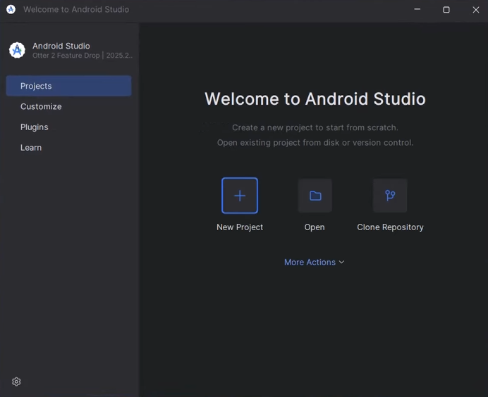
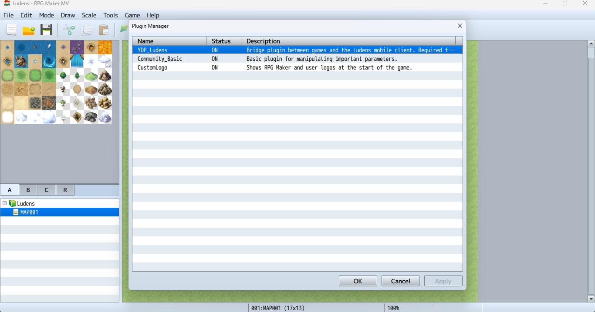
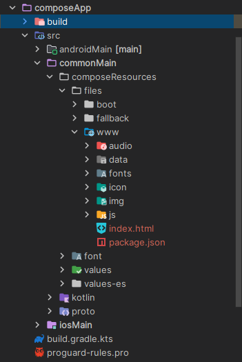
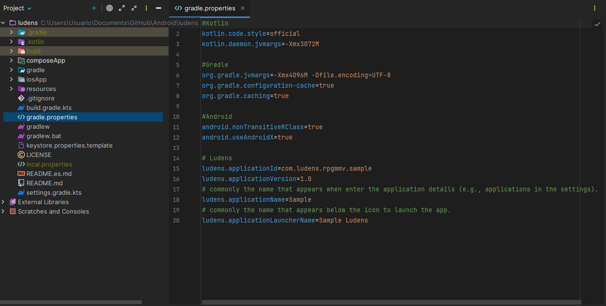
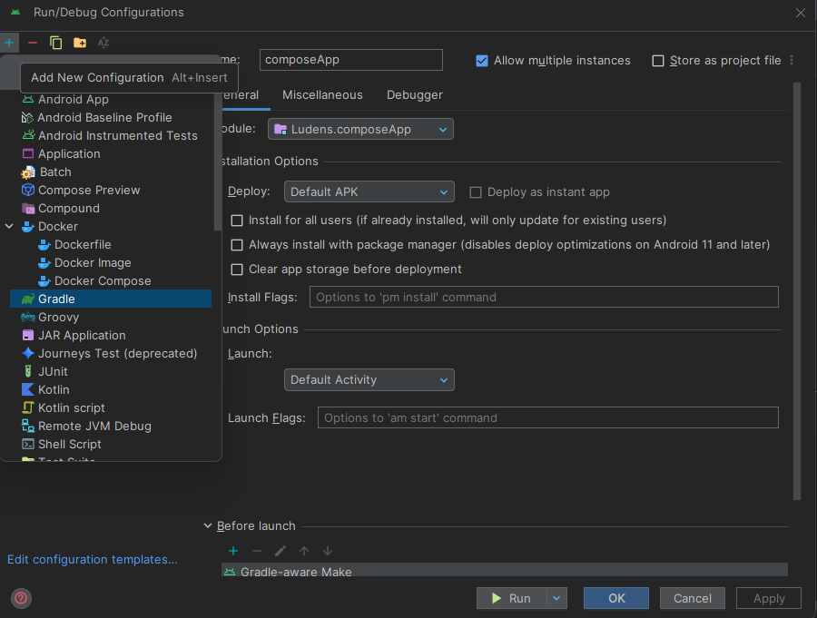
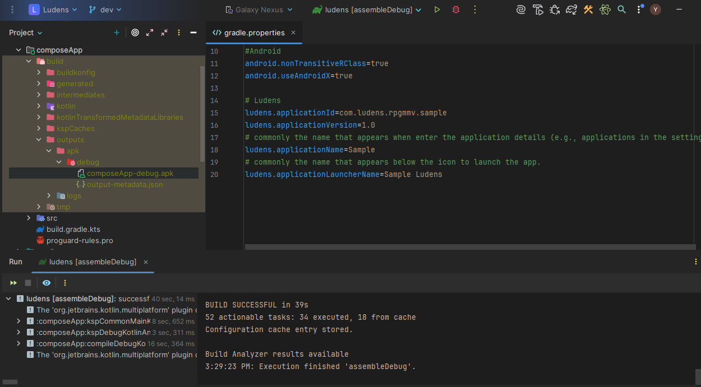
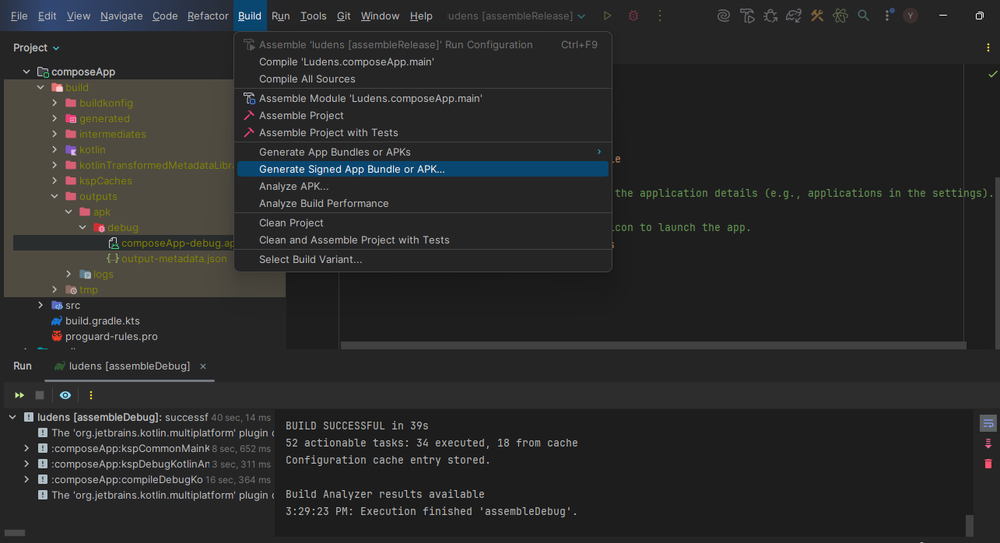
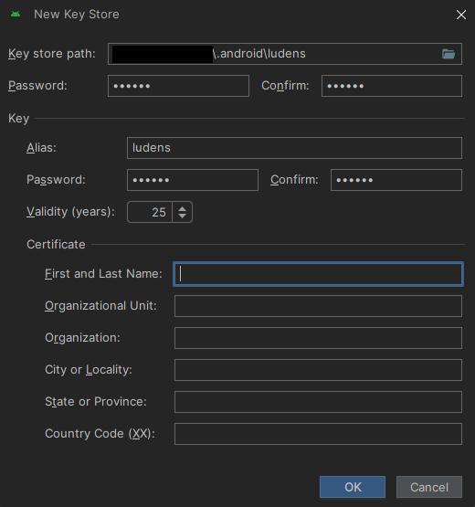
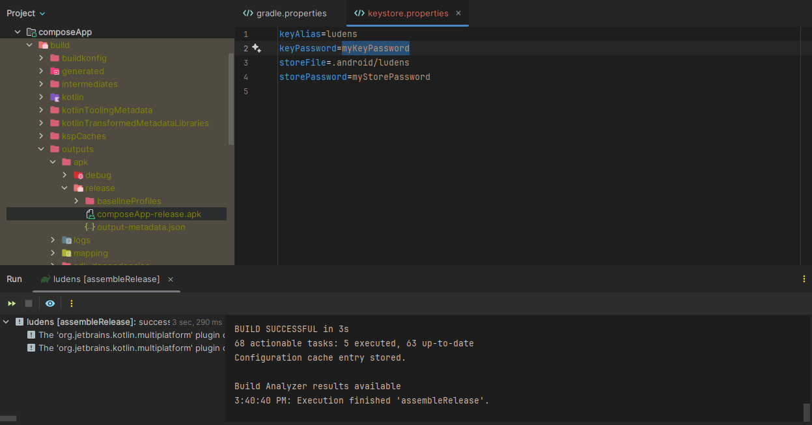

# Guía de Construcción Paso a Paso
[Read in English](BUILD.md)

Esta guía detalla el proceso completo para configurar, personalizar y generar un archivo APK/AAB de tu juego RPG Maker MV/MZ utilizando **Ludens**.

## Configuración del Entorno

### Android Studio
Descarga e instala Android Studio. Para este proyecto se recomienda usar la versión **Otter 2 Feature Drop | 2025.2.2** o superior.

*   **Enlace de descarga**: [developer.android.com/studio](https://developer.android.com/studio)
*   **Guia de instalación**: [developer.android.com/studio/install](https://developer.android.com/studio/install)
*   [Guía de configuración oficial](https://developer.android.com/courses/pathways/android-basics-compose-unit-1-pathway-2)

<p align="center">
  
  <br>
  <em>Figura 1: Pantalla de bienvenida de Android Studio donde se puede verificar la versión instalada.</em>
</p>

Asegúrate de que durante la instalación se incluyan:
*   Android SDK
*   Android SDK Platform-Tools
*   Android Virtual Device (Recomendado para pruebas)

### Java Development Kit (JDK)
El proyecto requiere **Java 17**. Android Studio suele incluir una versión compatible (JetBrains Runtime), pero puedes instalar JDK 17 manualmente si lo prefieres.

*   **Guía de instalación oficial**: [Cómo instalar el JDK](https://docs.oracle.com/en/java/javase/17/install/overview-jdk-installation.html)

## Prerrequisitos del Juego (RPG Maker)

Antes de exportar tu juego, considera lo siguiente:

### Plugins y Compatibilidad
*   **Advertencia**: Muchos plugins de RPG Maker están diseñados solo para PC (escritorio). Verifica que tus plugins sean compatibles con entornos móviles (WebView).
*   **Plugin Recomendado**: [`YDP_Ludens.js`](resources/plugins/js/YDP_Ludens.js). Puedes encontrar la última versión y otros plugins recomendados en el [repositorio rpgm-plugins](https://github.com/yoimerdr/rpgm-plugins).
    *   Este plugin ayuda a solucionar problemas de carga de fuentes en versiones antiguas de WebView y habilita funcionalidades extra.
    *   **Importante**: Colócalo como el **primer plugin** en tu lista.

<p align="center">
  
  <br>
  <em>Figura 2: El plugin YDP_Ludens.js debe colocarse en la parte superior de la lista para asegurar su correcta carga.</em>
</p>

## Configuración del Proyecto Ludens

### Obtener el Proyecto
1.  Clona este repositorio o descárgalo como ZIP y extráelo.
2.  Abre Android Studio.
3.  Selecciona **Open** y navega hasta la carpeta del proyecto `ludens`.
4.  Espera a que Gradle termine de sincronizar (Download/Sync).

<p align="center">
  
  <br>
  <em>Figura 3: Vista del proyecto en Android Studio una vez finalizada la sincronización de Gradle.</em>
</p>

### Estructura de Directorios
Familiarízate con la ubicación de los archivos clave:
*   `composeApp/src/commonMain/composeResources/files`: Aquí irá tu juego.
*   `gradle.properties`: Aquí configurarás el nombre y versión.

## Exportar el Juego
1.  Abre tu proyecto en RPG Maker MV o MZ.
2.  Ve a **Archivo** > **Despliegue** (Deployment).
3.  Selecciona la plataforma **Android / iOS** (Recomendado). Si no está disponible, usa **Web Browsers**.
4.  Exporta el juego.

<p align="center">
  
  <br>
  <em>Figura 4: Selecciona la opción Android / iOS al desplegar tu juego.</em>
</p>

## Integración de Assets

Este es el paso más crítico.

1.  Navega a la carpeta del proyecto en tu explorador de archivos:
    `composeApp/src/commonMain/composeResources/files`
2.  Copia la carpeta **`www`** completa de tu exportación y pégala dentro de `files` o si solo cuentas con los assets del juego, crea la carpeta `www` y pega los archivos dentro de ella.

**Estructura Obligatoria:**
La aplicación espera encontrar `index.html` dentro de `www`.
<p align="center">
  
  <br>
  <em>Figura 5: Vista de Android Studio mostrando la carpeta www y el archivo index.html dentro de composeResources/files</em>
</p>

## Android
### Personalización

Edita el archivo `gradle.properties` en la raíz del proyecto.

```properties
# ID único (formato com.dominio.nombre)
ludens.applicationId=com.miestudio.rpg

# Versión visible (ej. 1.0)
ludens.applicationVersion=1.0

# Nombre en Ajustes
ludens.applicationName=Mi RPG Épico

# Nombre en el Launcher (Icono)
ludens.applicationLauncherName=Mi RPG
```

<p align="center">
  
  <br>
  <em>Figura 6: Modificación de las propiedades del proyecto para personalizar ID, versión y nombre.</em>
</p>

#### Icono de la App
Reemplaza las imágenes en `composeApp/src/androidMain/res/mipmap-*` o usa la herramienta **Image Asset Studio**:
1.  Click derecho en `composeApp/src/androidMain/res`.
2.  New > Image Asset.

<p align="center">
  
  <br>
  <em>Figura 7: Uso de Image Asset Studio para actualizar el icono de la aplicación.</em>
</p>

### Compilar y Probar (Debug)

Para pruebas durante el desarrollo, puedes usar la terminal o crear una configuración en Android Studio.

#### Opción A: Configuración de Ejecución (Recomendado)
Si prefieres usar la interfaz de Android Studio:

1.  Abre el menú de configuraciones y selecciona **Edit Configurations...**.
<p align="center">
  
  <br>
  <em>Figura 8: Acceso al menú de configuraciones.</em>
</p>

2.  Agrega una nueva tarea de **Gradle**.
<p align="center">
  
  <br>
  <em>Figura 9: Creación de una nueva tarea de Gradle.</em>
</p>

3.  Nombra la tarea (ej. `assembleDebug`) y en el campo **Arguments** escribe: `assembleDebug`.
<p align="center">
  
  <br>
  <em>Figura 10: Configuración de los argumentos de la tarea.</em>
</p>

#### Opción B: Terminal
1.  Abre la pestaña **Terminal** en Android Studio.
2.  Ejecuta:
    ```bash
    ./gradlew assembleDebug
    ```

#### Resultado
Independientemente del método, el APK aparecerá en: `composeApp/build/outputs/apk/debug/composeApp-debug.apk`.

> **Recomendación**: Instala este APK en un emulador o dispositivo real para verificar que el juego carga y los plugins funcionan correctamente.

<p align="center">
  
  <br>
  <em>Figura 11: Resultado exitoso de la compilación.</em>
</p>

### Crear Versión de Producción (Release)

Para generar el APK final firmado:

#### Opción A: Asistente de Android Studio
Esta opción te guía paso a paso para firmar tu aplicación.

1.  Ve a **Build > Generate Signed Bundle / APK**.
<p align="center">
  
  <br>
  <em>Figura 12: Iniciar el asistente de firma.</em>
</p>

2.  Selecciona **APK** y haz clic en Next.

3.  Configura tu Keystore (Almacén de claves).

    *   **Crear Nueva**: Si no tienes una, haz clic en **Create new...**.
        <p align="center">
          
          <br>
          <em>Figura 13: Creación de un nuevo almacén de claves (Keystore). Guarda bien la contraseña y el archivo .jks.</em>
        </p>

    *   **Usar Existente**: Si ya tienes una, cárgala e introduce las credenciales.
        <p align="center">
          
          <br>
          <em>Figura 14: Credenciales del Keystore.</em>
        </p>

4.  Selecciona el build flavor **release** y haz clic en **Create**.
<p align="center">
  
  <br>
  <em>Figura 15: Selección de la variante de salida.</em>
</p>

5.  **Resultado**:
<p align="center">
  
  <br>
  <em>Figura 16: Notificación de APK generado exitosamente.</em>
</p>

#### Opción B: Tarea Gradle (Configurable)
Similar al proceso de Debug, esta opción es ideal para automatizar el build, pero requiere configuración manual previa.

1.  Asegúrate de tener tu archivo `.jks` (Keystore) generado (puedes usar el paso 3 de la Opción A para crearlo).
2.  Crea/Edita el archivo `keystore.properties` en la raíz del proyecto con la ruta y credenciales:

    ```properties
    storePassword=tu_store_password
    keyPassword=tu_key_password
    keyAlias=tu_alias
    storeFile=C:/Ruta/A/Tu/llave.jks
    ```

3.  Ejecuta la tarea `assembleRelease` desde la ventana de configuraciones (como se vio en la sección Debug) o desde la terminal:
    ```bash
    ./gradlew assembleRelease
    ```

4.  **Resultado**:
<p align="center">
  
  <br>
  <em>Figura 17: Resultado de la compilación desde Gradle.</em>
</p>

#### Ubicación del Archivo
*   **Si usaste la Opción A (Asistente)**: Por defecto, Android Studio suele ubicarlo en `composeApp/release/` (o la carpeta que hayas seleccionado durante el paso de destino).
*   **Si usaste la Opción B (Gradle)**: El archivo estará en `composeApp/build/outputs/apk/release/composeApp-release.apk`.


## iOS

*Próximamente* - La configuración actual es la predeterminada de Compose Multiplatform.