# Guía de Construcción Paso a Paso

<p align="center">
  <a href="BUILD.md">Read in English</a> | <a href="https://tryludens.vercel.app/">Docs Web</a>
</p>

Esta guía detalla el proceso completo para configurar, personalizar y generar un archivo APK/AAB de tu juego RPG Maker MV/MZ utilizando **Ludens**.

## Configuración del Entorno

### Android Studio

Descarga e instala Android Studio. Para este proyecto se recomienda usar la versión **Otter 2 Feature Drop | 2025.2.2** o superior.

- **Enlace de descarga**: [developer.android.com/studio](https://developer.android.com/studio)
- **Guia de instalación**: [developer.android.com/studio/install](https://developer.android.com/studio/install)
- [Guía de configuración oficial](https://developer.android.com/courses/pathways/android-basics-compose-unit-1-pathway-2)

<p align="center">
  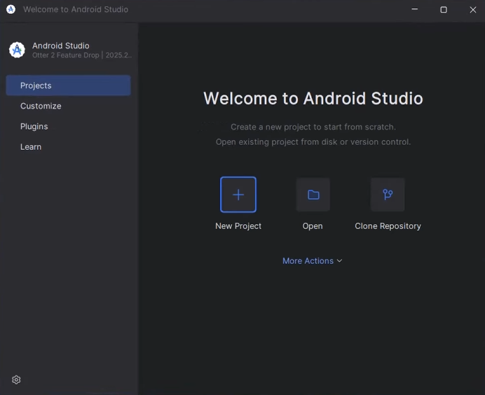
  <br>
  <em>Figura 1: Pantalla de bienvenida de Android Studio donde se puede verificar la versión instalada.</em>
</p>

Asegúrate de que durante la instalación se incluyan:

- Android SDK
- Android SDK Platform-Tools
- Android Virtual Device (Recomendado para pruebas)

### Java Development Kit (JDK)

El proyecto requiere **Java 17**. Android Studio suele incluir una versión compatible (JetBrains Runtime), pero puedes instalar JDK 17 manualmente si lo prefieres.

- **Guía de instalación oficial**: [Cómo instalar el JDK](https://docs.oracle.com/en/java/javase/17/install/overview-jdk-installation.html)

## Prerrequisitos del Juego (RPG Maker)

Antes de exportar tu juego, considera lo siguiente:

### Plugins y Compatibilidad

- **Advertencia**: Muchos plugins de RPG Maker están diseñados solo para PC (escritorio). Verifica que tus plugins sean compatibles con entornos móviles (WebView).
- **Plugin Recomendado**: [`YDP_Ludens.js`](resources/plugins/js/YDP_Ludens.js). Puedes encontrar la última versión y otros plugins recomendados en el [repositorio rpgm-plugins](https://github.com/yoimerdr/rpgm-plugins).
  - Este plugin ayuda a solucionar problemas de carga de fuentes en versiones antiguas de WebView y habilita funcionalidades extra.
  - **Importante**: Colócalo como el **primer plugin** en tu lista.

<p align="center">
  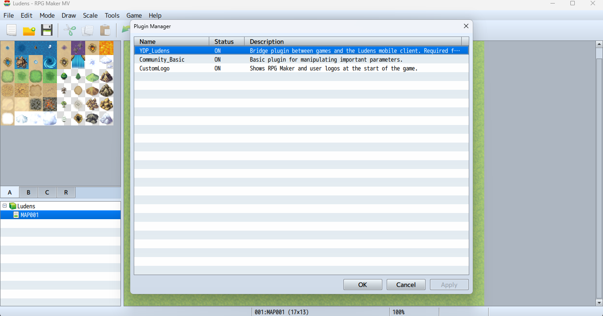
  <br>
  <em>Figura 2: El plugin YDP_Ludens.js debe colocarse en la parte superior de la lista para asegurar su correcta carga.</em>
</p>

## Configuración del Proyecto Ludens

### Obtener el Proyecto

1. Clona el repositorio.
   - Para usar la última versión de lanzamiento (reemplaza `<latest_tag>` por la última etiqueta de versión disponible, ej. `0.4.0`):
     ```bash
     git clone --branch <latest_tag> https://github.com/yoimerdr/ludens.git
     ```
   - Si prefieres usar la última versión en desarrollo, clona la rama `develop`:
     ```bash
     git clone --branch develop https://github.com/yoimerdr/ludens.git
     ```
   - Alternativamente, puedes descargarlo como archivo ZIP desde la página de [GitHub Releases](https://github.com/yoimerdr/ludens/releases) y extraerlo.
2. Abre Android Studio.
3.  Selecciona **Open** y navega hasta la carpeta del proyecto `ludens`.
4.  Espera a que Gradle termine de sincronizar (Download/Sync).

<p align="center">
  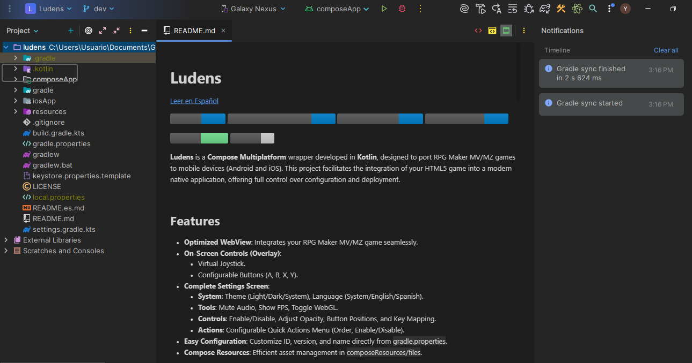
  <br>
  <em>Figura 3: Vista del proyecto en Android Studio una vez finalizada la sincronización de Gradle.</em>
</p>

### Estructura de Directorios

Familiarízate con la ubicación de los archivos clave:

- `shared/src/commonMain/composeResources/files`: Aquí irá tu juego.
- [`ludens.properties`](ludens.properties): Configuración principal de Ludens (identidad app, flags de manifest, permisos y preset de settings).
- [`gradle.properties`](gradle.properties): Opciones de Gradle/Kotlin para rendimiento y sistema de build.
- [`keystore.properties`](keystore.properties): Credenciales locales de firma release (no subir al repositorio).

## Exportar el Juego

1.  Abre tu proyecto en RPG Maker MV o MZ.
2.  Ve a **Archivo** > **Despliegue** (Deployment).
3.  Selecciona la plataforma **Android / iOS** (Recomendado). Si no está disponible, usa **Web Browsers**.
4.  Exporta el juego.

<p align="center">
  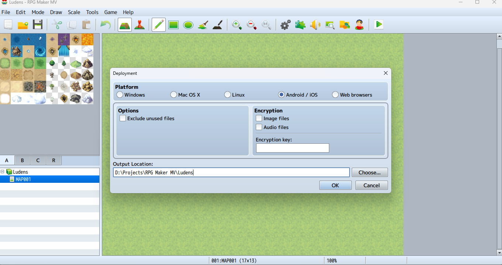
  <br>
  <em>Figura 4: Selecciona la opción Android / iOS al desplegar tu juego.</em>
</p>

## Integración de Assets

Este es el paso más crítico.

> [!WARNING]
> **Sensibilidad de Mayúsculas/Minúsculas**: El sistema de archivos de Windows es **insensible** (`/Path/Example` = `/path/example`), pero Android e iOS usan sistemas de archivos **sensibles**. Asegúrate de que todas las referencias a archivos en el código de tu juego (imágenes, audio, archivos de datos) usen nombres **exactamente iguales**. Si un archivo se llama `MiImagen.png`, debes referenciarlo como `MiImagen.png`, no como `miimagen.png`. Esta es una causa común de fallos silenciosos en móviles.
>
> **Tip**: Puedes usar el plugin **[YDP_CrossAssets](https://github.com/yoimerdr/rpgm-plugins)** del repositorio rpgm-plugins para normalizar automáticamente las rutas de archivos y evitar este problema.

Tienes dos opciones válidas para integrar tus assets:

**Opción A (Recomendada): Sincronización desde Carpeta Raíz**

1. Navega a la raíz del repositorio del proyecto Ludens.
2. Ubica la carpeta `project/www/`.
3. Copia el contenido de tu carpeta **`www`** exportada dentro de `project/www/`.

> [!NOTE]
> El sistema de construcción sincroniza automáticamente los assets desde `project/www/` hacia la carpeta interna requerida (`composeResources/files/www`). Esta sincronización **solo** ocurre si hay archivos en `project/www/` además del archivo `index.html`.

**Opción B: Colocación Directa en Carpeta Interna**

1. Navega a la carpeta interna de recursos:
   `shared/src/commonMain/composeResources/files/`
2. Copia la carpeta **`www`** completa de tu exportación y pégala dentro de `files`.

**Estructura Interna Obligatoria:**
Después de usar cualquiera de las opciones, la aplicación espera encontrar `index.html` dentro del directorio interno `www`.

<p align="center">
  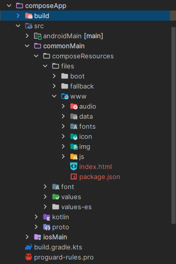
  <br>
  <em>Figura 5: Vista de Android Studio mostrando la carpeta www y el archivo index.html dentro de composeResources/files</em>
</p>

## Localización y Traducciones

Ludens admite múltiples idiomas para la interfaz de usuario del cliente/wrapper.

> [!IMPORTANT]
> Este sistema de localización traduce **únicamente** la interfaz nativa del cliente/wrapper (como las opciones de la pantalla de Ajustes, la superposición de controles y los diálogos nativos). **No** traduce el contenido, textos o diálogos del juego de RPG Maker dentro del WebView. Los diálogos y recursos del juego deben ser traducidos usando los propios plugins o archivos de traducción de RPG Maker dentro de la carpeta exportada `www/`.

El sistema de traducciones funciona con dos componentes principales:

### 1. Restringir Idiomas Disponibles
Por defecto, la compilación incluye todos los idiomas encontrados en el proyecto. Si tu juego está destinado a un solo idioma o a un conjunto específico de idiomas, puedes restringir las opciones mostradas en el menú de ajustes del wrapper modificando [`ludens.properties`](ludens.properties):

```properties
# Limitar el menú de ajustes para mostrar solo inglés y español
ludens.languages.available=en,es
```

### 2. Añadir un Nuevo Idioma
Para añadir claves de traducción para un idioma que no esté incluido por defecto:

1. Crea un directorio con el nombre de la etiqueta de idioma ISO (por ejemplo, `fr` para francés, `ja` para japonés) dentro de `project/assets/languages/`:
   `project/assets/languages/fr/`
2. Crea un archivo llamado `strings.xml` dentro de ese directorio.
3. Copia el contenido del archivo [strings.xml](project/assets/languages/en/strings.xml) en inglés como base y traduce los valores de las cadenas. Por ejemplo:
   ```xml
   <resources>
       <string name="settings_title">Paramètres</string>
       <string name="tab_system">Système</string>
       ...
   </resources>
   ```
4. Si estás usando la propiedad `ludens.languages.available` para restringir los idiomas, asegúrate de añadir la nueva etiqueta de idioma a la lista.
5. Vuelve a compilar el proyecto. El sistema de compilación procesará automáticamente los recursos y generará los directorios de traducción correspondientes durante la compilación.

> [!WARNING]
> **NO** edites ni agregues archivos `strings.xml` directamente dentro de `shared/src/commonMain/composeResources/values*`. Durante la compilación, una tarea personalizada de Gradle limpia estas carpetas y las regenera a partir de la fuente de verdad (`project/assets/languages/`). Cualquier cambio manual dentro de `composeResources` se **perderá permanentemente**.

## Android

### Personalización

Edita el archivo [`ludens.properties`](ludens.properties) en la raíz del proyecto.

```properties
# ID único (formato com.dominio.nombre)
ludens.android.id=com.miestudio.rpg

# Versión visible (ej. 1.0.0)
ludens.android.version=1.0.0

# Versión interna (entero)
ludens.android.versionCode=1

# Nombre en Ajustes
ludens.android.name=Mi RPG Épico

# Nombre en el Launcher (Icono)
ludens.android.launcherName=Mi RPG
```

> [!IMPORTANT]
> Ludens ahora lee primero [`ludens.properties`](ludens.properties). Si no existe, puede leer las mismas claves `ludens.*` desde [`gradle.properties`](gradle.properties); claves antiguas como `ludens.applicationId` ya no son compatibles.

<p align="center">
  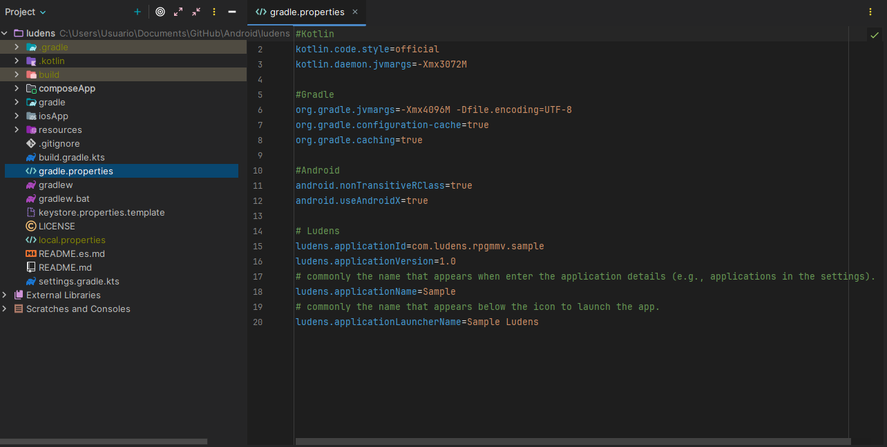
  <br>
  <em>Figura 6: Modificación de las propiedades del proyecto para personalizar ID, versión y nombre.</em>
</p>

#### Configuración Opcional de Android/Manifest

También puedes personalizar comportamiento Android con [`ludens.properties`](ludens.properties):

```properties
# Placeholders del manifest
ludens.android.manifest.allowBackup=true
ludens.android.manifest.largeHeap=true
ludens.android.manifest.hardwareAccelerated=true
ludens.android.manifest.screenOrientation=sensorLandscape
ludens.android.manifest.usesCleartextTraffic=false
ludens.android.manifest.resizeableActivity=false

# Manifest de permisos generado
# Todos los permisos listados son opcionales;
# El wrapper no requiere ni usa funcionalidades que dependan de ellos.
# Si tu juego requiere permisos adicionales aparte de acceso basico de red
# Es posible que necesites editar el codigo fuente del wrapper.
ludens.android.permissions.internet=false
ludens.android.permissions.networkState=false
ludens.android.permissions.wakeLock=false
ludens.android.permissions.accessWifiState=false
ludens.android.permissions.changeWifiState=false
```

Estos valores son consumidos por plugins personalizados en `build-logic` durante la compilación.

> [!TIP]
> Ludens soporta más propiedades de configuración. Revisa directamente [`ludens.properties`](ludens.properties) para ver la lista completa y su descripción.

#### Icono de la App

Ludens incluye un plugin de **Generación de Iconos Automatizado** que crea todos los iconos de lanzamiento para cada plataforma a partir de una única imagen de origen (SVG o PNG).

##### Método A: Generación Automática (Recomendado)

1. Coloca tu imagen de origen del icono dentro del directorio `project/assets/icons/`.
   - Para obtener mejores resultados, usa una imagen vectorial llamada `icon.svg` o una imagen rasterizada de alta resolución llamada `icon.png` (de al menos 512x512 píxeles).
   - Si deseas usar capas adaptativas separadas para Android, puedes colocar `icon_foreground.svg`/`icon_foreground.png` e `icon_background.svg`/`icon_background.png` en el mismo directorio.
2. Configura el generador de iconos en [`ludens.properties`](ludens.properties) bajo la sección `# ----- App Icon Generator -----`. Los valores son leídos automáticamente por el sistema de compilación:

```properties
# Nombre del icono maestro origen en project/assets/icons/
ludens.icons.name=icon

# Nombre de la capa frontal adaptativa en project/assets/icons/
ludens.icons.foreground=icon_foreground

# Color de fondo hexagonal sólido o referencia a recurso
ludens.icons.background=#FDFDFD

# Configuración específica de Android
ludens.icons.android.enable=true
ludens.icons.android.format=webp
ludens.icons.android.playstore=true

# Configuración específica de iOS
ludens.icons.ios.enable=true

# Escala del recurso frontal dentro del visor de icono adaptativo
ludens.icons.scale=0.62
```

3. Compila el proyecto. El sistema de compilación generará automáticamente:
   - **Android**: Iconos mipmap heredados (cuadrados y redondos), hojas XML de iconos adaptativos en `mipmap-anydpi-v26` y capas vectoriales/rasterizadas (`ic_launcher_foreground`, `ic_launcher_background`) ubicadas en `androidApp/src/main/res/`.
   - **iOS**: Todos los tamaños necesarios de AppIcon (iPhone, iPad, App Store) junto con su manifiesto `Contents.json` correspondiente en `iosApp/iosApp/Assets.xcassets/AppIcon.appiconset`.
   - **Google Play Store**: Un icono de alta resolución `ic_launcher-playstore.png` (512x512) para la ficha de la tienda.

##### Método B: Configuración Manual (Alternativa)

Si prefieres generar tus recursos manualmente o usar las herramientas estándar de desarrollo de Android:

> [!WARNING]
> **Desactivar la Generación Automática**: Para evitar que la tarea del generador automático sobrescriba tus archivos manuales personalizados en cada compilación, **DEBES** desactivar el generador automático en [`ludens.properties`](ludens.properties):
> ```properties
> ludens.icons.android.enable=false
> ludens.icons.ios.enable=false
> ```

1. Haz clic derecho en el directorio `androidApp/src/main/res` en Android Studio.
2. Selecciona **New > Image Asset**.
3. Sigue el asistente de Image Asset Studio para configurar tus capas y escala.

<p align="center">
  
  <br>
  <em>Figura 7: Uso de Image Asset Studio para actualizar el icono de la aplicación manualmente.</em>
</p>

### Compilar y Probar (Debug)

Para pruebas durante el desarrollo, puedes usar la terminal o crear una configuración en Android Studio.

#### Opción A: Configuración de Ejecución (Recomendado)

Si prefieres usar la interfaz de Android Studio:

1.  Abre el menú de configuraciones y selecciona **Edit Configurations...**.
<p align="center">
  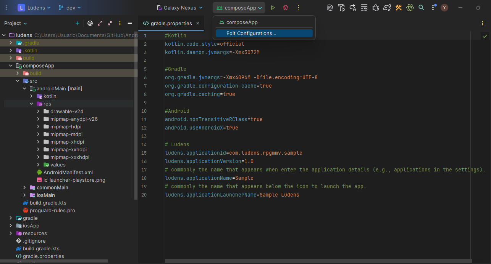
  <br>
  <em>Figura 8: Acceso al menú de configuraciones.</em>
</p>

2.  Agrega una nueva tarea de **Gradle**.
<p align="center">
  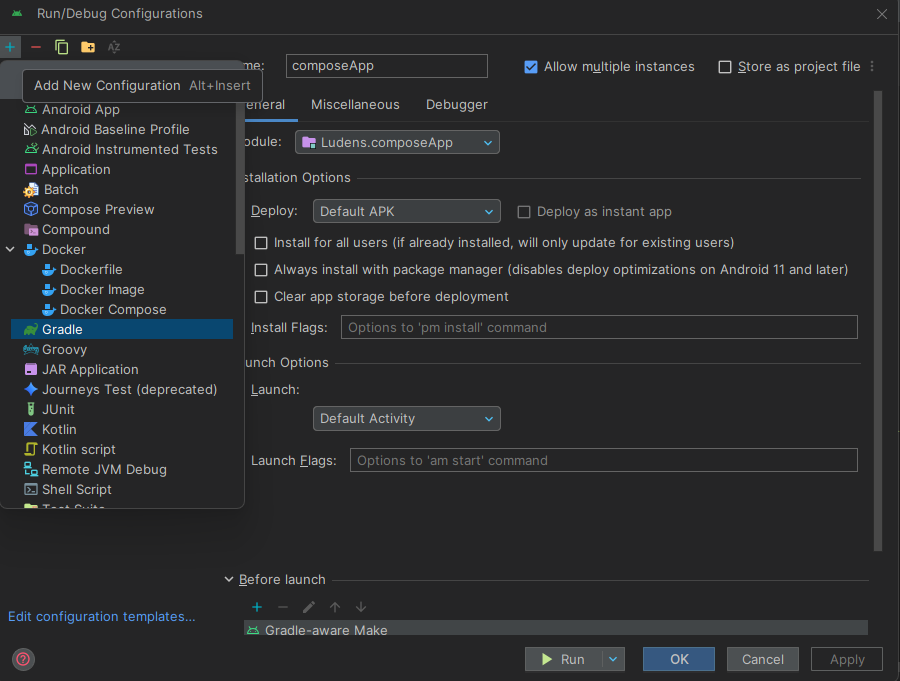
  <br>
  <em>Figura 9: Creación de una nueva tarea de Gradle.</em>
</p>

3.  Nombra la tarea (ej. `assembleDebug`) y en el campo **Arguments** escribe: `assembleDebug`.
<p align="center">
  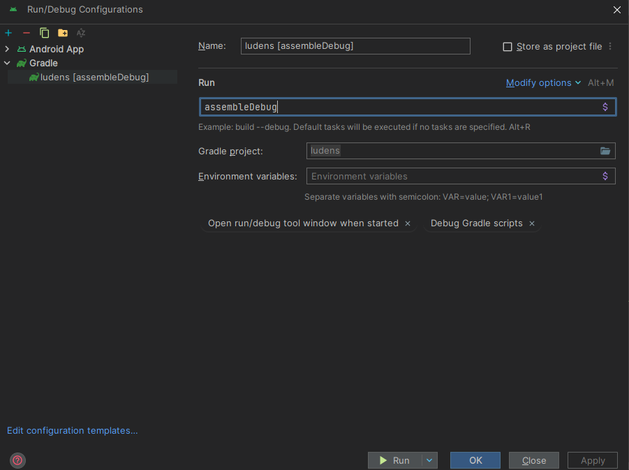
  <br>
  <em>Figura 10: Configuración de los argumentos de la tarea.</em>
</p>

#### Opción B: Terminal

1.  Abre la pestaña **Terminal** en Android Studio.
2.  Ejecuta:
    ```bash
    ./gradlew assembleDebug
    ```

#### Resultado

Independientemente del método, el APK aparecerá en: `androidApp/build/outputs/apk/debug/androidApp-debug.apk` (copia post-procesada: `output/debug/Ludens-0.4.0-debug.apk`).

> [!TIP]
> Instala este APK en un emulador o dispositivo real para verificar que el juego carga y los plugins funcionan correctamente.

<p align="center">
  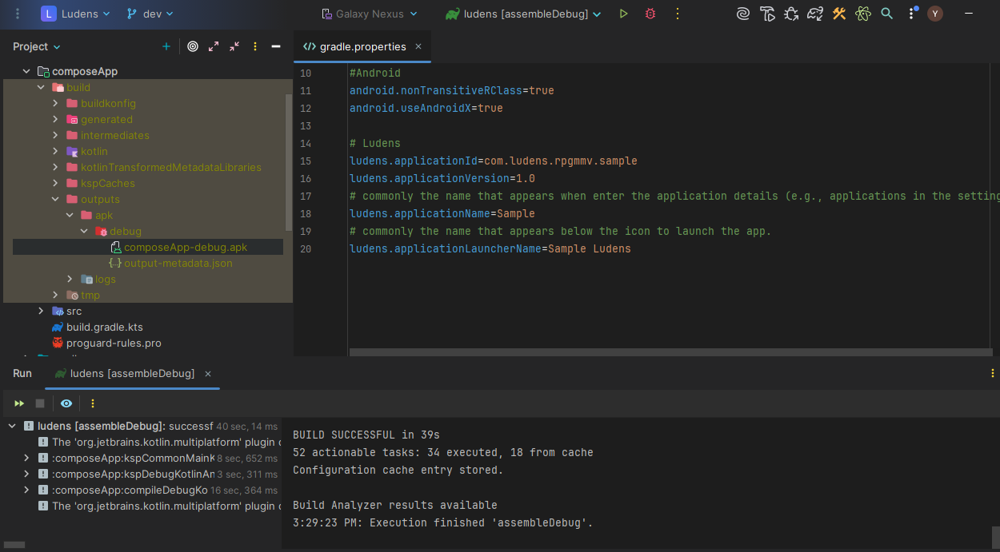
  <br>
  <em>Figura 11: Resultado exitoso de la compilación.</em>
</p>

### Crear Versión de Producción (Release)

Para generar el APK final firmado:

#### Opción A: Asistente de Android Studio

Esta opción te guía paso a paso para firmar tu aplicación.

1.  Ve a **Build > Generate Signed Bundle / APK**.
<p align="center">
  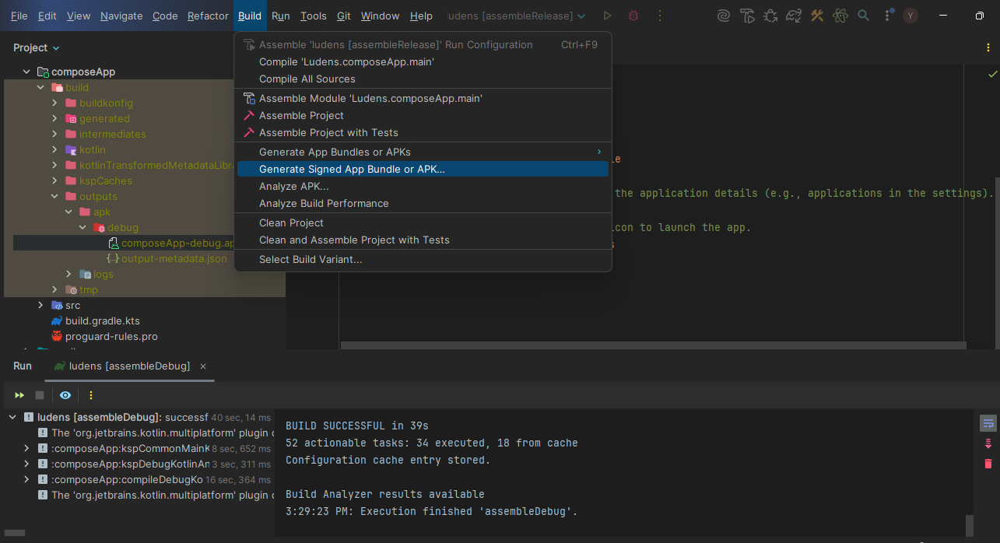
  <br>
  <em>Figura 12: Iniciar el asistente de firma.</em>
</p>

2.  Selecciona **APK** y haz clic en Next.

3.  Configura tu Keystore (Almacén de claves).
    - **Crear Nueva**: Si no tienes una, haz clic en **Create new...**.
      <p align="center">
        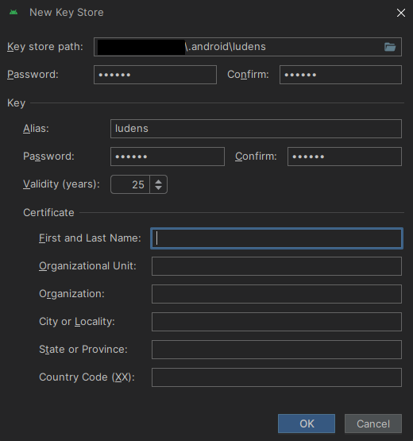
        <br>
        <em>Figura 13: Creación de un nuevo almacén de claves (Keystore). Guarda bien la contraseña y el archivo .jks.</em>
      </p>

    - **Usar Existente**: Si ya tienes una, cárgala e introduce las credenciales.
      <p align="center">
        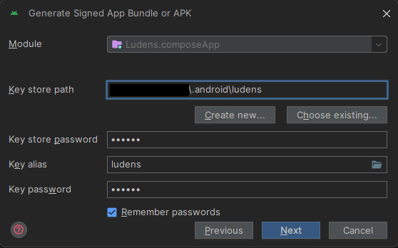
        <br>
        <em>Figura 14: Credenciales del Keystore.</em>
      </p>

4.  Selecciona el build flavor **release** y haz clic en **Create**.
<p align="center">
  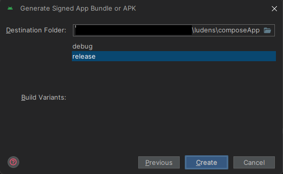
  <br>
  <em>Figura 15: Selección de la variante de salida.</em>
</p>

5.  **Resultado**:
<p align="center">
  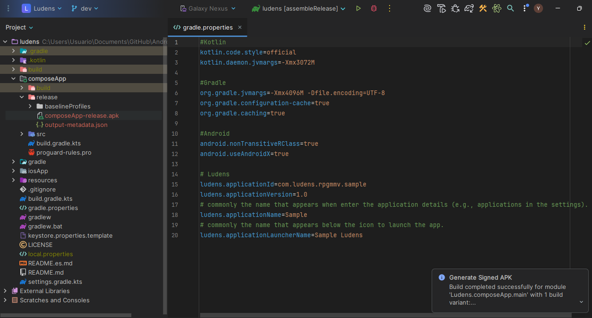
  <br>
  <em>Figura 16: Notificación de APK generado exitosamente.</em>
</p>

#### Opción B: Tarea Gradle (Configurable)

Similar al proceso de Debug, esta opción es ideal para automatizar el build, pero requiere configuración manual previa.

1.  Asegúrate de tener tu archivo `.jks` (Keystore) generado (puedes usar el paso 3 de la Opción A para crearlo).
2.  Crea/Edita el archivo [`keystore.properties`](keystore.properties) en la raíz del proyecto con la ruta y credenciales:

    ```properties
    storePassword=tu_store_password
    keyPassword=tu_key_password
    keyAlias=tu_alias
    storeFile=C:/Ruta/A/Tu/llave.jks
    ```

    Puedes usar [`keystore.properties.template`](keystore.properties.template) como referencia.

3.  Ejecuta la tarea `assembleRelease` desde la ventana de configuraciones (como se vio en la sección Debug) o desde la terminal:

    ```bash
    ./gradlew assembleRelease
    ```

4.  **Resultado**:
<p align="center">
  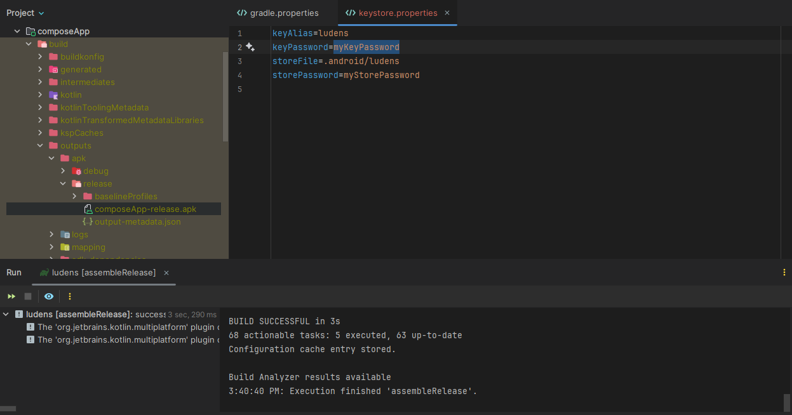
  <br>
  <em>Figura 17: Resultado de la compilación desde Gradle.</em>
</p>

#### Ubicación del Archivo

- **Si usaste la Opción A (Asistente)**: Por defecto, Android Studio suele ubicarlo en `androidApp/release/` (o la carpeta que hayas seleccionado durante el paso de destino).
- **Si usaste la Opción B (Gradle)**: El archivo estará en `androidApp/build/outputs/apk/release/androidApp-release.apk` (copia post-procesada: `output/release/Ludens-0.4.0-release.apk`).

## iOS

_Próximamente_ - La configuración actual es la predeterminada de Compose Multiplatform.
