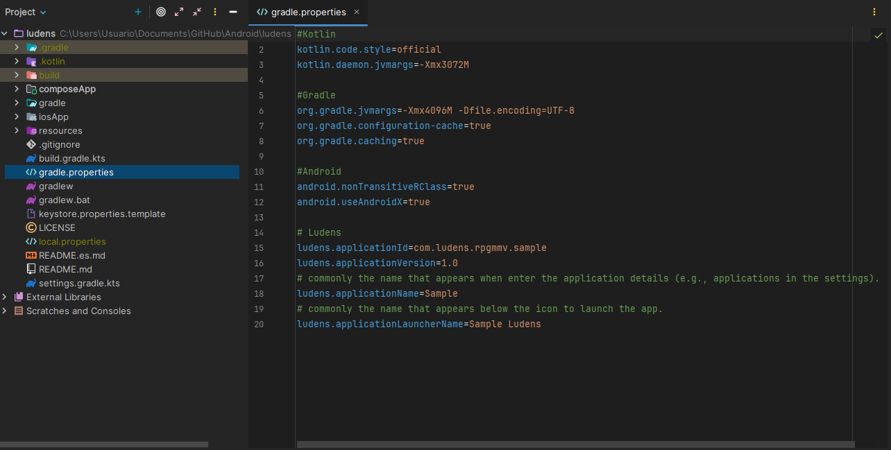

All application identity and build properties are managed through `gradle.properties` in the project root. No Kotlin code changes are required for basic customization.

## Application Properties

Edit the `gradle.properties` file in the project root:

```properties
# Unique application identifier (reverse domain format)
ludens.applicationId=com.yourorganization.sample

# Version visible to the user
ludens.applicationVersion=1.0

# Application name displayed in system settings
ludens.applicationName=Game Name

# Short name displayed under the home screen icon
ludens.applicationLauncherName=Game
```



### Property Reference

| Property                          | Format                  | Description                                                |
|-----------------------------------|-------------------------|------------------------------------------------------------|
| `ludens.applicationId`            | `com.domain.name`       | Unique identifier for the app. Must be unique on the Play Store. |
| `ludens.applicationVersion`       | `x.y` (e.g., `1.0`)    | User-visible version string.                                |
| `ludens.applicationName`          | Free text               | Full application name shown in system settings.             |
| `ludens.applicationLauncherName`  | Short text              | Name displayed under the home screen icon.                  |

:::note
The `applicationId` must follow the reverse domain format and must be unique if you plan to publish on the Google Play Store. Changing it after publication creates a new listing.
:::

## Application Icon

Replace the default icon by updating the images in `composeApp/src/androidMain/res/mipmap-*` directories, or use the **Image Asset Studio** tool in Android Studio:

1. Right-click on `composeApp/src/androidMain/res`.
2. Select **New > Image Asset**.
3. Configure the icon using your game's artwork.


The `mipmap-*` directories contain icons at different resolutions:

| Directory       | Resolution |
|----------------|------------|
| `mipmap-mdpi`   | 48×48 px   |
| `mipmap-hdpi`   | 72×72 px   |
| `mipmap-xhdpi`  | 96×96 px   |
| `mipmap-xxhdpi` | 144×144 px |
| `mipmap-xxxhdpi`| 192×192 px |

## Signing Configuration

For release builds, you need a signing keystore. Create a `keystore.properties` file in the project root using the provided template:

```properties
storePassword=your_store_password
keyPassword=your_key_password
keyAlias=your_alias
storeFile=C:/Path/To/Your/key.jks
```

A `keystore.properties.template` file is included in the repository for reference.

:::caution[Security]
Never commit your `keystore.properties` file or `.jks` keystore to version control.
:::

## Manifest Customization

For more advanced configuration beyond what `gradle.properties` offers, you can directly edit the `AndroidManifest.xml` file.

The manifest file is located at:
`composeApp/src/androidMain/AndroidManifest.xml`

:::caution
Modifying the manifest incorrectly can cause your application to crash on startup or fail to build. Make sure you understand the changes you are making.
:::

### Game Orientation

By default, Ludens forces the application into landscape mode using `sensorLandscape`. This ensures the game rotates according to the device sensor but stays in a horizontal orientation.

To change this, locate the `<activity>` tag in your manifest and modify the `android:screenOrientation` attribute.

### Common Orientations

| Value | Behavior |
|-------|----------|
| `sensorLandscape` | (Default) Landscape only, auto-rotates between left and right landscape based on sensor. |
| `sensorPortrait` | Portrait only, auto-rotates between normal and upside-down portrait based on sensor. |
| `landscape` | Fixed landscape orientation (ignoring sensor). |
| `portrait` | Fixed portrait orientation (ignoring sensor). |
| `fullSensor` | Allows rotation to any of the 4 orientations. |

**Example for a portrait game:**
```xml
<activity
    android:exported="true"
    android:screenOrientation="sensorPortrait"
    android:configChanges="orientation|screenSize"
    android:name=".MainActivity"
    android:label="@string/app_launcher_name">
    ...
</activity>
```

### Adding Permissions

If your RPG Maker plugins require access to device hardware (like the camera, microphone, or internet access), you must declare those permissions in the manifest. Ludens does not enforce any specific permissions by default to keep the app as privacy-friendly as possible.

For example, if your game features an AR (Augmented Reality) mini-game plugin, you will need the `CAMERA` permission. Or if your game fetches highscores from an online leaderboard, you will need `INTERNET`.

Add the `<uses-permission>` tag as a direct child of the `<manifest>` element (outside the `<application>` tag).

:::caution[Runtime Permissions]
Declaring the permission in the manifest is the first step. However, for "dangerous" permissions (like Camera, Location, or Storage) on modern Android versions (6.0+), you must also request the permission from the user at runtime. Currently, Ludens does not include a native permission-request flow out of the box, so you may need to implement a JavaScript-to-Kotlin bridge to trigger the Android system dialogue, or use a third-party Cordova/Capacitor-style plugin if adapting the core.
:::

**Example: Adding Microphone permission:**
```xml
<manifest xmlns:android="http://schemas.android.com/apk/res/android">
    
    <!-- Add new permissions here -->
    <uses-permission android:name="android.permission.RECORD_AUDIO" />

    <application>
        ...
    </application>
</manifest>
```

### App Backup Configuration

By default, the manifest includes `android:allowBackup="true"`. This allows Android's built-in backup service to back up your app's data to the user's Google Drive.

If your game contains sensitive data or if you want to opt out of the auto-backup system, you can change this to `false`.

```xml
<application
    android:allowBackup="false"
    ... >
```
