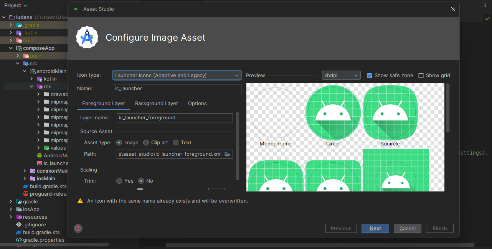

Las propiedades de identidad y el manifest específicos de Android se gestionan a través de
`ludens.properties` en la raíz del proyecto. Este sistema te permite personalizar tu aplicación sin
tocar código Kotlin ni scripts de compilación complejos.

## Identidad de la Aplicación

Estas propiedades definen el nombre del paquete, la versión y los nombres mostrados por el sistema
Android.

```properties
# ----- Android Identity -----
ludens.android.id=com.ludens.compose.ludens
ludens.android.version=0.3.0
ludens.android.versionCode=1
ludens.android.name=Ludens
ludens.android.launcherName=Ludens
ludens.android.minSDK=21
ludens.android.targetSDK=36
ludens.android.immersive=true
```

Configura estas propiedades usando el prefijo `ludens.android.*`:

| Propiedad      | Tipo     | Por defecto                 | Descripción                                                      |
|----------------|----------|-----------------------------|------------------------------------------------------------------|
| `id`           | String   | `com.ludens.compose.ludens` | Identificador único de la aplicación (package name).             |
| `version`      | String   | `0.3.0`                     | Nombre de la versión visible para el usuario.                    |
| `versionCode`  | Entero   | `1`                         | Código de versión interno para actualizaciones en la Play Store. |
| `name`         | String   | `Ludens`                    | Nombre completo de la aplicación en ajustes del sistema.         |
| `launcherName` | String   | `Ludens`                    | Nombre mostrado bajo el icono en la pantalla de inicio.          |
| `minSDK`       | Entero   | `21`                        | Nivel mínimo de API de Android soportado.                        |
| `targetSDK`    | Entero   | `36`                        | Nivel de API de Android al que se dirige la compilación.         |
| `immersive`    | Booleano | `true`                      | Activa el modo inmersivo (oculta las barras del sistema).        |

:::note
El `id` debe seguir el formato de dominio invertido y debe ser único si planeas publicar en Google
Play
Store. Cambiarlo después de la publicación crea una nueva ficha de aplicación.
:::

## Icono de la Aplicación

Reemplaza el icono predeterminado actualizando las imágenes en los directorios
`composeApp/src/androidMain/res/mipmap-*`, o usa la herramienta **Image Asset Studio** en Android
Studio:

1. Haz clic derecho en `composeApp/src/androidMain/res`.
2. Selecciona **New > Image Asset**.
3. Configura el icono usando el arte de tu juego.



Los directorios `mipmap-*` contienen iconos en diferentes resoluciones:

| Directorio       | Resolución |
|------------------|------------|
| `mipmap-mdpi`    | 48×48 px   |
| `mipmap-hdpi`    | 72×72 px   |
| `mipmap-xhdpi`   | 96×96 px   |
| `mipmap-xxhdpi`  | 144×144 px |
| `mipmap-xxxhdpi` | 192×192 px |

## Configuración del Manifest

Ludens genera automáticamente el archivo `AndroidManifest.xml` basándose en estas propiedades. Esto
permite una gestión
segura y predecible del manifest.

```properties
# ----- Android Manifest -----
ludens.android.manifest.allowBackup=true
ludens.android.manifest.largeHeap=true
ludens.android.manifest.hardwareAccelerated=true
ludens.android.manifest.screenOrientation=sensorLandscape
ludens.android.manifest.usesCleartextTraffic=false
ludens.android.manifest.resizeableActivity=false
```

### Orientación del Juego

Por defecto, Ludens fuerza la aplicación al modo horizontal usando `sensorLandscape`. Esto asegura
que el juego rote
según el sensor del dispositivo pero se mantenga en una orientación horizontal. Para cambiar esto,
modifica la propiedad
`ludens.android.manifest.screenOrientation`.

#### Orientaciones Comunes

| Valor             | Comportamiento                                                                                               |
|-------------------|--------------------------------------------------------------------------------------------------------------|
| `sensorLandscape` | (Predeterminado) Solo horizontal, rota automáticamente entre horizontal izquierdo y derecho según el sensor. |
| `sensorPortrait`  | Solo vertical, rota automáticamente entre vertical normal e invertido según el sensor.                       |
| `landscape`       | Orientación horizontal fija (ignorando el sensor).                                                           |
| `portrait`        | Orientación vertical fija (ignorando el sensor).                                                             |
| `fullSensor`      | Permite la rotación a cualquiera de las 4 orientaciones.                                                     |

### Referencia de Propiedades

Configura estas propiedades usando el prefijo `ludens.android.manifest.*`:

| Propiedad              | Tipo     | Mapeo                          | Descripción                                                           |
|------------------------|----------|--------------------------------|-----------------------------------------------------------------------|
| `allowBackup`          | Booleano | `android:allowBackup`          | Indica si Android puede realizar copias de seguridad en Google Drive. |
| `largeHeap`            | Booleano | `android:largeHeap`            | Solicita un montón más grande para juegos pesados.                    |
| `hardwareAccelerated`  | Booleano | `android:hardwareAccelerated`  | Activa la aceleración por GPU para la interfaz.                       |
| `screenOrientation`    | String   | `android:screenOrientation`    | Define la orientación de pantalla (ver tabla arriba).                 |
| `usesCleartextTraffic` | Booleano | `android:usesCleartextTraffic` | Permite tráfico HTTP en claro (No recomendado).                       |
| `resizeableActivity`   | Booleano | `android:resizeableActivity`   | Permite que el sistema cambie el tamaño de la actividad.              |

## Permisos

Si tus plugins de RPG Maker requieren acceso al hardware del dispositivo o servicios de red, debes
declarar esos
permisos. Ludens facilita esto con interruptores integrados.

Por ejemplo, si tu juego obtiene puntuaciones de una tabla de clasificación en línea, necesitarás el
permiso `internet`.
Si tu juego debe evitar que la pantalla se apague durante escenas largas, usa el permiso `wakeLock`.

```properties
# ----- Android Permissions -----
ludens.android.permissions.internet=false
ludens.android.permissions.networkState=false
ludens.android.permissions.wakeLock=false
ludens.android.permissions.accessWifiState=false
ludens.android.permissions.changeWifiState=false
```

Declara estos permisos bajo el prefijo `ludens.android.permissions.*`:

| Propiedad         | Tipo     | Mapeo                  | Descripción                                           |
|-------------------|----------|------------------------|-------------------------------------------------------|
| `internet`        | Booleano | `INTERNET`             | Otorga acceso a la red para funciones online.         |
| `networkState`    | Booleano | `ACCESS_NETWORK_STATE` | Acceso al estado y tipo de red.                       |
| `wakeLock`        | Booleano | `WAKE_LOCK`            | Mantiene la CPU activa mientras se renderiza o juega. |
| `accessWifiState` | Booleano | `ACCESS_WIFI_STATE`    | Acceso al estado de la conexión Wi-Fi.                |
| `changeWifiState` | Booleano | `CHANGE_WIFI_STATE`    | Permiso para cambiar la conectividad Wi-Fi.           |

## Avanzado: Personalización Manual del Manifest

Para configuraciones no cubiertas por `ludens.properties`, puedes editar el manifest directamente en
`composeApp/src/androidMain/AndroidManifest.xml`.

:::caution
Modificar el manifest incorrectamente puede causar que tu aplicación se cierre al iniciar. Los
cambios manuales pueden
entrar en conflicto con el generador automático.
:::

### Añadir Permisos Personalizados

Si tus plugins requieren acceso al hardware como la Cámara o el Micrófono, añade la etiqueta
`<uses-permission>` como
hijo directo del elemento `<manifest>`.

Ejemplo: Añadir permiso de Micrófono:

```xml

<manifest xmlns:android="http://schemas.android.com/apk/res/android">

    <!-- Añadir nuevos permisos aquí -->
    <uses-permission android:name="android.permission.RECORD_AUDIO" />

    <application>...</application>
</manifest>
```

:::caution[Permisos en Tiempo de Ejecución]
Para los permisos "peligrosos" (Cámara, Ubicación, etc.) en Android 6.0+, también debes solicitar el
permiso en tiempo
de ejecución mediante un puente personalizado. Actualmente, Ludens no incluye un puente nativo para
esto.
:::

## Configuración de Firma

Para compilaciones de producción, necesitas un almacén de llaves. Crea un archivo
`keystore.properties` en la raíz del
proyecto basado en el archivo `keystore.properties.template`:

```properties
storePassword=tu_store_password
keyPassword=tu_key_password
keyAlias=tu_alias
storeFile=C:/Ruta/A/Tu/llave.jks
```

:::caution[Seguridad]
Nunca subas tu archivo `keystore.properties` o el almacén de llaves `.jks` al control de versiones.
:::
