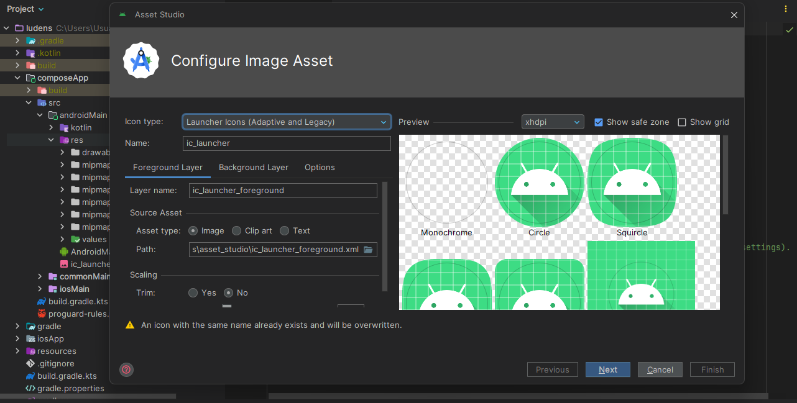

Las propiedades de identidad y el manifest específicos de Android se gestionan a través de
`ludens.properties` en la raíz del proyecto. Este sistema te permite personalizar tu aplicación sin
tocar código Kotlin ni scripts de compilación complejos.

## Identidad de la Aplicación

Android lee su identidad del espacio de nombres compartido `ludens.app.*` por defecto (ver
[Configuración Compartida](/es/configuration/shared/#identidad-de-la-app)). Las claves de abajo son
sobreescrituras opcionales exclusivas de Android — están comentadas en `ludens.properties` y solo
necesitas establecerlas cuando Android deba divergir del valor compartido (por ejemplo, un ID de
paquete diferente para una tienda específica).

```properties
# Sobreescrituras opcionales de identidad para Android
# ludens.android.id=
# ludens.android.version=
# ludens.android.versionCode=
# ludens.android.name=

# Etiqueta del lanzador de Android
ludens.android.launcherName=Ludens
ludens.android.minSDK=21
ludens.android.targetSDK=37
ludens.android.immersive=true
```

Propiedades configurables usando el prefijo `ludens.android.*`:

| Propiedad      | Tipo     | Por defecto (hereda de)  | Descripción                                                                        |
|----------------|----------|--------------------------|------------------------------------------------------------------------------------|
| `id`           | String   | `ludens.app.id`          | Identificador de la app. Sobreescribir si el valor compartido no puede usarse tal cual. |
| `version`      | String   | `ludens.app.version`     | Sobreescritura del nombre de versión visible para Android.                         |
| `versionCode`  | Entero   | `ludens.app.versionCode` | Entero de compatibilidad de actualizaciones en Play Store. Sobreescribir si Android necesita un contador diferente. |
| `name`         | String   | `ludens.app.name`        | Nombre completo de la aplicación en ajustes del sistema Android.                  |
| `launcherName` | String   | `Ludens`                 | Nombre mostrado bajo el icono en la pantalla de inicio (exclusivo Android).        |
| `minSDK`       | Entero   | `21`                     | Nivel mínimo de API de Android soportado.                                          |
| `targetSDK`    | Entero   | `37`                     | Nivel de API de Android al que se dirige la compilación.                           |
| `immersive`    | Booleano | `true`                   | Activa el modo inmersivo (oculta las barras del sistema).                          |

:::note
El identificador debe seguir el formato de dominio invertido y ser único si planeas publicar en
Google Play Store. Cambiarlo después de la publicación crea una nueva ficha de aplicación.
:::

## Icono de la Aplicación

Ludens incluye un plugin **Generador Automático de Iconos de la App** que crea los iconos de inicio para todas las plataformas de destino a partir de una sola imagen origen (SVG o PNG).

### Generación Automática (Recomendado)

1. Coloca tu imagen de icono origen dentro del directorio `project/assets/icons/`.
   - Para mejores resultados, usa una imagen vectorial llamada `icon.svg` o una imagen rasterizada de alta resolución llamada `icon.png` (de al menos 512x512 píxeles).
   - Si deseas usar capas adaptativas separadas para Android, puedes colocar `icon_foreground.svg`/`icon_foreground.png` e `icon_background.svg`/`icon_background.png` en ese mismo directorio.
2. Configura el generador de iconos en `ludens.properties`:

```properties
# Nombre del icono maestro origen en project/assets/icons/
ludens.icons.name=icon

# Nombre de la capa adaptativa de primer plano en project/assets/icons/
ludens.icons.foreground=icon_foreground

# Color de fondo hexadecimal sólido o referencia de recurso
ludens.icons.background=#FDFDFD

# Configuración específica de Android
ludens.icons.android.enable=true
ludens.icons.android.format=webp
ludens.icons.android.playstore=true

# Configuración específica de iOS
ludens.icons.ios.enable=true

# Escala del elemento de primer plano dentro del viewport del icono adaptativo
ludens.icons.scale=0.62
```

3. Compila el proyecto. El sistema de compilación generará automáticamente:
   - **Android**: Iconos mipmap redondos y cuadrados tradicionales, hojas de iconos adaptativos XML bajo `mipmap-anydpi-v26` y capas vectoriales/rasterizadas (`ic_launcher_foreground`, `ic_launcher_background`) colocadas en `androidApp/src/main/res/`.
   - **iOS**: Todos los tamaños de AppIcon requeridos (iPhone, iPad, App Store) junto con el manifiesto del catálogo de assets `Contents.json` correspondiente bajo `iosApp/iosApp/Assets.xcassets/AppIcon.appiconset`.
   - **Google Play Store**: Un icono de ficha en alta resolución `ic_launcher-playstore.png` (512x512).

### Configuración Manual (Alternativa)

Si prefieres generar tus recursos manualmente o usar las herramientas estándar de desarrollo de Android:

:::caution[Desactivar Generación Automática]
Para evitar que la tarea del generador automático sobrescriba tus archivos manuales personalizados en cada compilación, **DEBES** desactivar el generador automático en `ludens.properties`:
```properties
ludens.icons.android.enable=false
ludens.icons.ios.enable=false
```
:::

1. Haz clic derecho en el directorio `androidApp/src/main/res` en Android Studio.
2. Selecciona **New > Image Asset**.
3. Usa el asistente de Image Asset Studio para configurar tus capas y escala.



## Configuración del Manifest

Ludens genera automáticamente el archivo `AndroidManifest.xml` basándose en estas propiedades. Esto
permite una gestión
segura y predecible del manifest.

```properties
# ----- Android Manifest -----
ludens.android.manifest.allowBackup=true
ludens.android.manifest.largeHeap=true
ludens.android.manifest.hardwareAccelerated=true
ludens.android.manifest.screenOrientation=sensorLandscape
ludens.android.manifest.usesCleartextTraffic=false
ludens.android.manifest.resizeableActivity=false
```

### Orientación del Juego

Por defecto, Ludens fuerza la aplicación al modo horizontal usando `sensorLandscape`. Esto asegura
que el juego rote
según el sensor del dispositivo pero se mantenga en una orientación horizontal. Para cambiar esto,
modifica la propiedad
`ludens.android.manifest.screenOrientation`.

#### Orientaciones Comunes

| Valor             | Comportamiento                                                                                               |
|-------------------|--------------------------------------------------------------------------------------------------------------|
| `sensorLandscape` | (Predeterminado) Solo horizontal, rota automáticamente entre horizontal izquierdo y derecho según el sensor. |
| `sensorPortrait`  | Solo vertical, rota automáticamente entre vertical normal e invertido según el sensor.                       |
| `landscape`       | Orientación horizontal fija (ignorando el sensor).                                                           |
| `portrait`        | Orientación vertical fija (ignorando el sensor).                                                             |
| `fullSensor`      | Permite la rotación a cualquiera de las 4 orientaciones.                                                     |

### Referencia de Propiedades

Configura estas propiedades usando el prefijo `ludens.android.manifest.*`:

| Propiedad              | Tipo     | Mapeo                          | Descripción                                                           |
|------------------------|----------|--------------------------------|-----------------------------------------------------------------------|
| `allowBackup`          | Booleano | `android:allowBackup`          | Indica si Android puede realizar copias de seguridad en Google Drive. |
| `largeHeap`            | Booleano | `android:largeHeap`            | Solicita un montón más grande para juegos pesados.                    |
| `hardwareAccelerated`  | Booleano | `android:hardwareAccelerated`  | Activa la aceleración por GPU para la interfaz.                       |
| `screenOrientation`    | String   | `android:screenOrientation`    | Define la orientación de pantalla (ver tabla arriba).                 |
| `usesCleartextTraffic` | Booleano | `android:usesCleartextTraffic` | Permite tráfico HTTP en claro (No recomendado).                       |
| `resizeableActivity`   | Booleano | `android:resizeableActivity`   | Permite que el sistema cambie el tamaño de la actividad.              |

## Permisos

Si tus plugins de RPG Maker requieren acceso al hardware del dispositivo o servicios de red, debes
declarar esos
permisos. Ludens facilita esto con interruptores integrados.

Por ejemplo, si tu juego obtiene puntuaciones de una tabla de clasificación en línea, necesitarás el
permiso `internet`.
Si tu juego debe evitar que la pantalla se apague durante escenas largas, usa el permiso `wakeLock`.

```properties
# ----- Android Permissions -----
ludens.android.permissions.internet=false
ludens.android.permissions.networkState=false
ludens.android.permissions.wakeLock=false
ludens.android.permissions.accessWifiState=false
ludens.android.permissions.changeWifiState=false
```

Declara estos permisos bajo el prefijo `ludens.android.permissions.*`:

| Propiedad         | Tipo     | Mapeo                  | Descripción                                           |
|-------------------|----------|------------------------|-------------------------------------------------------|
| `internet`        | Booleano | `INTERNET`             | Otorga acceso a la red para funciones online.         |
| `networkState`    | Booleano | `ACCESS_NETWORK_STATE` | Acceso al estado y tipo de red.                       |
| `wakeLock`        | Booleano | `WAKE_LOCK`            | Mantiene la CPU activa mientras se renderiza o juega. |
| `accessWifiState` | Booleano | `ACCESS_WIFI_STATE`    | Acceso al estado de la conexión Wi-Fi.                |
| `changeWifiState` | Booleano | `CHANGE_WIFI_STATE`    | Permiso para cambiar la conectividad Wi-Fi.           |

## Avanzado: Personalización Manual del Manifest

Para configuraciones no cubiertas por `ludens.properties`, puedes editar el manifest directamente en
`androidApp/src/main/AndroidManifest.xml`.

:::caution
Modificar el manifest incorrectamente puede causar que tu aplicación se cierre al iniciar. Los
cambios manuales pueden
entrar en conflicto con el generador automático.
:::

### Añadir Permisos Personalizados

Si tus plugins requieren acceso al hardware como la Cámara o el Micrófono, añade la etiqueta
`<uses-permission>` como
hijo directo del elemento `<manifest>`.

Ejemplo: Añadir permiso de Micrófono:

```xml

<manifest xmlns:android="http://schemas.android.com/apk/res/android">

    <!-- Añadir nuevos permisos aquí -->
    <uses-permission android:name="android.permission.RECORD_AUDIO" />

    <application>...</application>
</manifest>
```

:::caution[Permisos en Tiempo de Ejecución]
Para los permisos "peligrosos" (Cámara, Ubicación, etc.) en Android 6.0+, también debes solicitar el
permiso en tiempo
de ejecución mediante un puente personalizado. Actualmente, Ludens no incluye un puente nativo para
esto.
:::

## Post-Procesado del Build de Android

Ludens puede renombrar y reubicar automáticamente el APK o AAB generado tras completar el build.
Esto es útil para organizar los artefactos de salida con una convención de nombres consistente sin
pasos manuales.

```properties
# Configuración de renombrado y reubicación de artefactos de Android
ludens.android.build.enable=true
ludens.android.build.outputDir=output/{buildType}
ludens.android.build.pattern={appName}-{versionName}-{buildType}
ludens.android.build.action=copy
ludens.android.build.includeVariants=all
```

Configura estas propiedades usando el prefijo `ludens.android.build.*`:

| Propiedad          | Tipo     | Por defecto                          | Descripción                                                                        |
|--------------------|----------|--------------------------------------|------------------------------------------------------------------------------------|
| `enable`           | Booleano | `true`                               | Activa la tarea de renombrado y reubicación post-build.                            |
| `outputDir`        | String   | `output/{buildType}`                 | Directorio de destino relativo a la raíz del proyecto. Admite marcadores.          |
| `pattern`          | String   | `{appName}-{versionName}-{buildType}` | Plantilla de nombre para el archivo de salida. La extensión se añade automáticamente. |
| `action`           | String   | `copy`                               | `copy` duplica el artefacto; `move` lo reubica desde el directorio de build.       |
| `includeVariants`  | String   | `all`                                | Variantes a procesar: `all`, `release`, `debug` o una lista separada por comas.    |

### Marcadores de Nombre

Los valores de `outputDir` y `pattern` admiten los siguientes marcadores:

| Marcador         | Valor                                              |
|------------------|----------------------------------------------------|
| `{appName}`      | Nombre de la app desde `ludens.app.name`           |
| `{name}`         | Nombre del módulo                                  |
| `{versionName}`  | Cadena de versión desde `ludens.app.version`       |
| `{versionCode}`  | Entero de versión desde `ludens.app.versionCode`   |
| `{buildType}`    | `debug` o `release`                                |
| `{minSdk}`       | SDK mínimo desde `ludens.android.minSDK`           |
| `{targetSdk}`    | SDK objetivo desde `ludens.android.targetSDK`      |
| `{timestamp}`    | Marca de tiempo del build                          |
| `{appId}`        | ID de la aplicación                                |
| `{artifactType}` | `apk` o `aab`                                      |

:::note[Ruta de salida]
Con la configuración por defecto, el APK debug post-procesado se coloca en
`output/debug/<appName>-<version>-debug.apk` en lugar de la ruta de salida raw de Gradle.
:::

---

## Configuración de Firma

Para compilaciones de producción, necesitas un almacén de llaves. Crea un archivo
`keystore.properties` en la raíz del
proyecto basado en el archivo `keystore.properties.template`:

```properties
storePassword=tu_store_password
keyPassword=tu_key_password
keyAlias=tu_alias
storeFile=C:/Ruta/A/Tu/llave.jks
```

:::caution[Seguridad]
Nunca subas tu archivo `keystore.properties` o el almacén de llaves `.jks` al control de versiones.
:::

## Diagnósticos de Error y Depuración

Ludens proporciona un sistema híbrido de intercepción de errores integrado para ayudarte a diagnosticar cierres inesperados del juego y fallos de carga del WebView.

```properties
# ----- WebView Debug & Error Reporting -----
# Activa la intercepción detallada de errores y muestra un diálogo de traceback para errores del juego.
ludens.debug.errors=true
```

Configura esta propiedad usando el prefijo `ludens.debug.*`:

| Propiedad | Tipo     | Por defecto | Descripción |
|-----------|----------|-------------|-------------|
| `errors`  | Booleano | `true`      | Activa la intercepción de errores en tiempo de ejecución del WebView y el diálogo de traceback. |

### Cómo Funciona

Cuando `ludens.debug.errors` está configurado en `true`:
1. **Excepciones de JavaScript**: Ludens inyecta un listener de errores en el WebView del juego para capturar excepciones de ejecución JavaScript no controladas y rechazos de promesas no manejados.
2. **Fallos de Carga Nativos**: El cliente WebView nativo intercepta fallos al cargar recursos (por ejemplo, archivos perdidos, rutas incorrectas, errores 404).
3. **Diálogo de Traceback**: En lugar de fallar silenciosamente o mostrar una pantalla negra, Ludens renderiza un diálogo nativo de Compose Multiplatform con el mensaje detallado de la excepción y el stack trace.
   - **Copiar al Portapapeles**: Copia el traceback técnico completo para depuración.
   - **Recomenzar**: Recarga instantáneamente el WebView y reinicia el juego.

:::note[Soporte de Plugin]
La captura del stack trace de JavaScript solo está completamente soportada si tienes cargado el plugin [`YDP_Ludens.js` (v1.2.0+)](https://github.com/yoimerdr/rpgm-plugins) como el primer plugin en tu proyecto de RPG Maker.
:::

