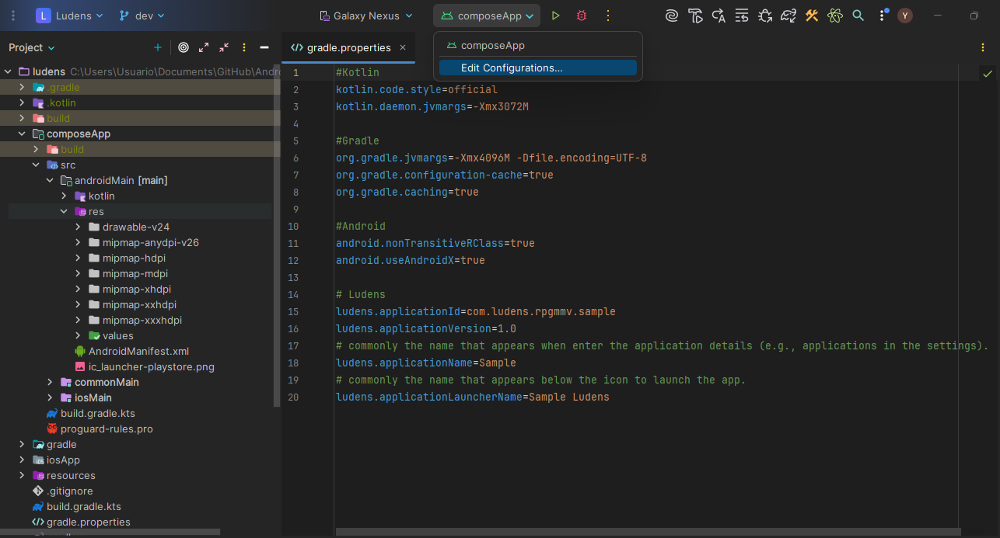
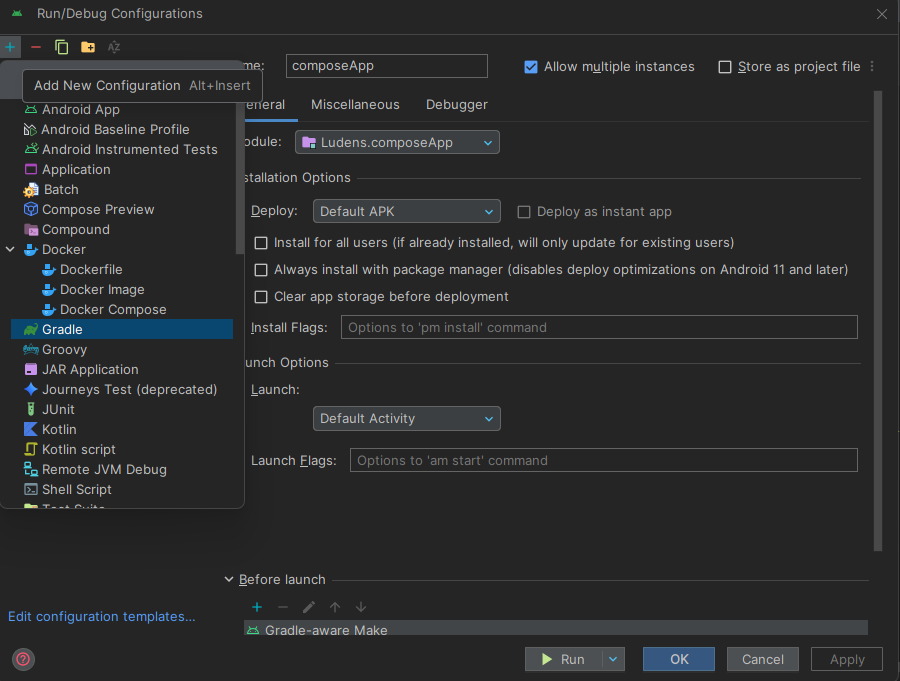
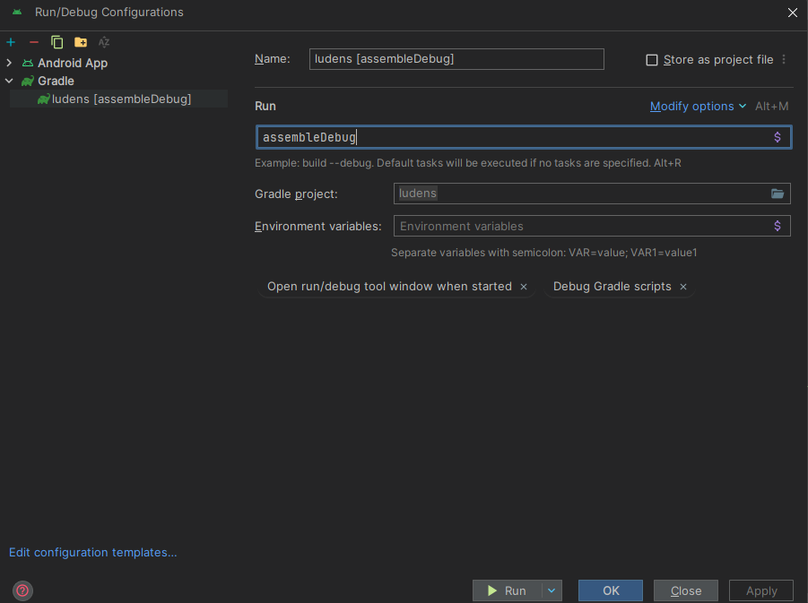
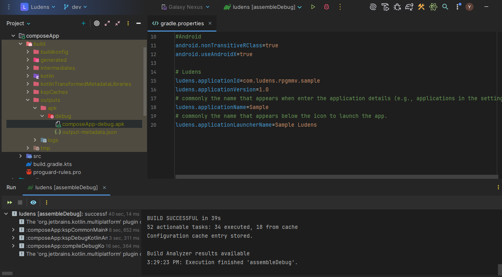
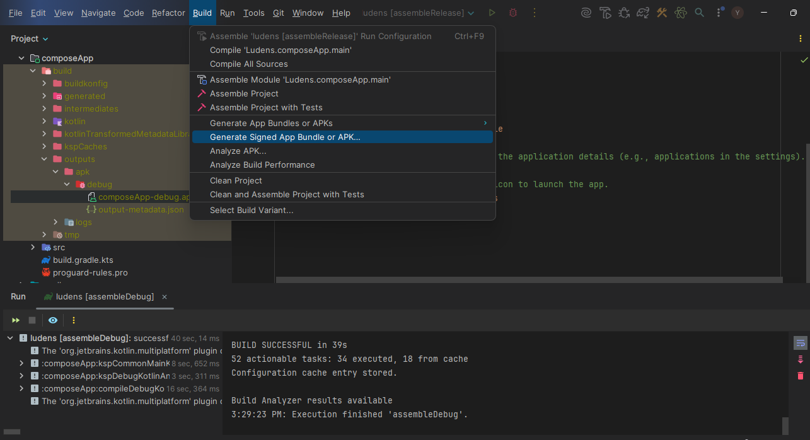
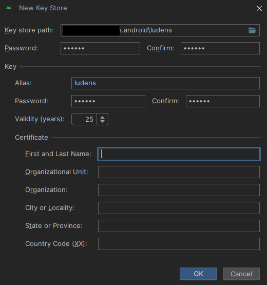
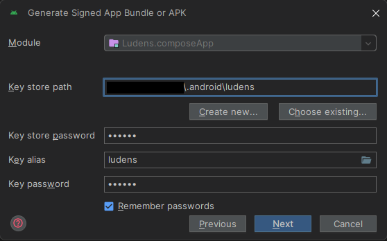
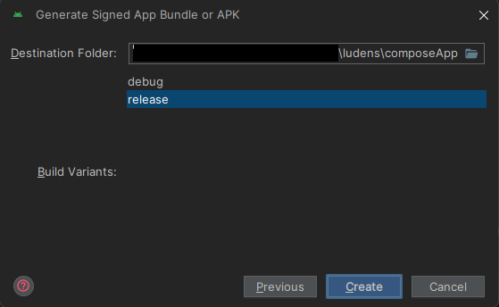
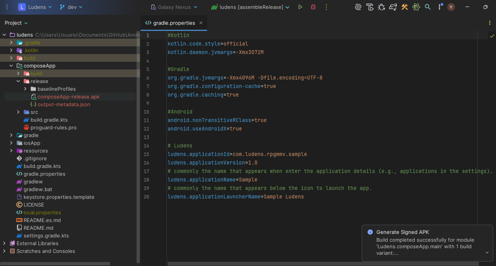
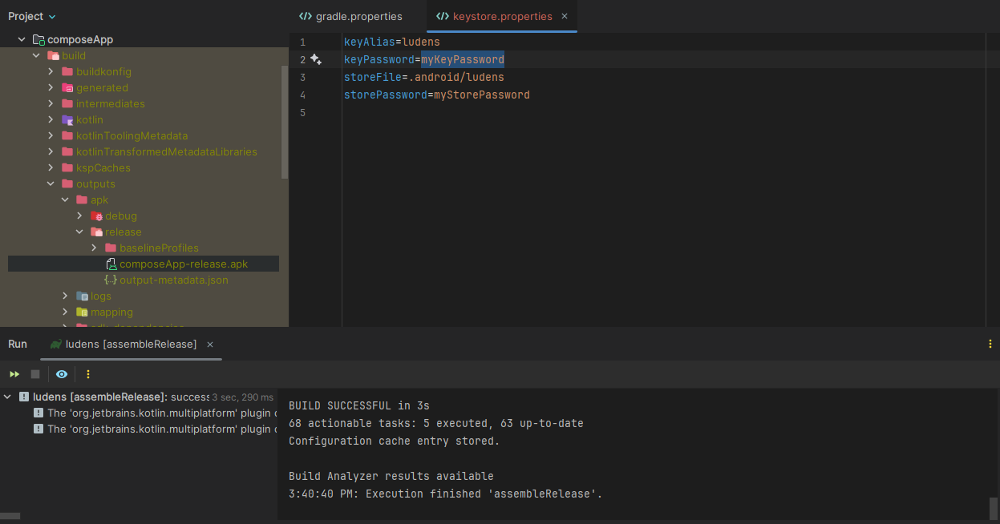

Esta guía cubre la compilación de APKs tanto de debug (pruebas) como de release (producción) para tu
juego de RPG Maker envuelto con Ludens.

## Configuración de la App

Antes de compilar tu APK, asegúrate de haber configurado la identidad de tu aplicación en
`ludens.properties`. Este archivo en la raíz del proyecto controla cómo Android identifica tu
aplicación.

```properties title="ludens.properties"
ludens.android.id=com.tudominio.juego
ludens.android.name=Mi Juego RPG
ludens.android.launcherName=Juego RPG
ludens.android.version=1.0.0
```

Para ver la lista completa de propiedades disponibles, incluyendo permisos y aceleración de
hardware, consulta la guía de [Configuración Android](/es/configuration/android/).

## Compilación Debug

Para pruebas rápidas en un emulador o dispositivo físico.

### Opción A: Configuración de Ejecución (Recomendado)

Si prefieres usar la interfaz de Android Studio:

1. Abre el menú de configuraciones y selecciona **Edit Configurations...**.



2. Agrega una nueva tarea de **Gradle**.



3. Nombra la tarea (ej. `assembleDebug`) y en el campo **Arguments** escribe: `assembleDebug`.



4. Haz clic en **Run** para iniciar la compilación.

### Opción B: Terminal

1. Abre la pestaña **Terminal** en Android Studio.
2. Ejecuta:
   ```bash
   ./gradlew assembleDebug
   ```

### Resultado

El APK se generará en:

```text
composeApp/build/outputs/apk/debug/composeApp-debug.apk
```



:::note[Application ID de Debug]
La compilación de debug automáticamente añade `.debug` a tu `applicationId`. Esto te permite
instalar tanto la versión de prueba como la versión de producción en el mismo dispositivo sin que
entren en conflicto.
:::

:::tip[Pruebas y Solución de Problemas]
Instala este APK en un emulador o dispositivo real para verificar que el juego carga y los plugins
funcionan correctamente antes de proceder con una compilación release.

Si encuentras errores extraños de compilación o tus assets no se actualizan, puedes limpiar la caché
de Gradle ejecutando:

```bash
./gradlew clean
```

:::

## Compilación Release

Para generar un APK firmado para distribución en producción.

### Opción A: Asistente de Android Studio

Esta opción te guía paso a paso para firmar tu aplicación.

1. Ve a **Build > Generate Signed Bundle / APK**.



2. Selecciona **APK** y haz clic en **Next**.

3. Configura tu Keystore:

   **Crear Nueva** — Si no tienes una, haz clic en **Create new...**.

   

   **Usar Existente** — Si ya tienes una, cárgala e introduce las credenciales.

   

4. Selecciona el build flavor **release** y haz clic en **Create**.



5. **Resultado**:



### Opción B: Tarea Gradle

Ideal para automatizar la compilación, pero requiere configuración manual previa.

1. Asegúrate de tener tu archivo `.jks` (Keystore) generado. Puedes usar el Paso 3 de la Opción A
   para crearlo.

2. Crea o edita el archivo `keystore.properties` en la raíz del proyecto con la ruta y credenciales:

   ```properties
   storePassword=tu_store_password
   keyPassword=tu_key_password
   keyAlias=tu_alias
   storeFile=C:/Ruta/A/Tu/llave.jks
   ```

3. Ejecuta la tarea `assembleRelease`:

   ```bash
   ./gradlew assembleRelease
   ```

4. **Resultado**:



### Ubicación del Archivo

| Método                   | Ubicación del APK                                                           |
|--------------------------|-----------------------------------------------------------------------------|
| **Asistente (Opción A)** | `composeApp/release/` (o la carpeta que seleccionaste durante el asistente) |
| **Gradle (Opción B)**    | `composeApp/build/outputs/apk/release/composeApp-release.apk`               |

:::caution[Seguridad del Keystore]
Mantén tu archivo `.jks` y las contraseñas seguros. Si los pierdes, no podrás actualizar tu
aplicación en la Play Store.
:::
