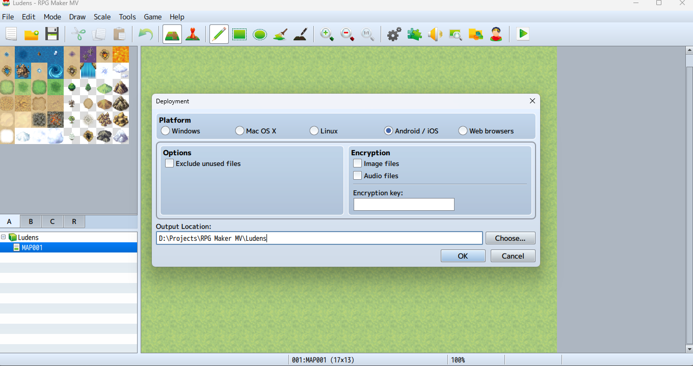
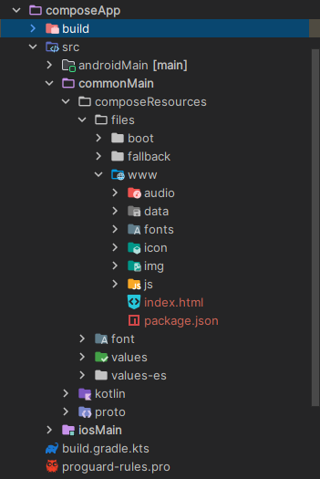

import { FileTree } from '@astrojs/starlight/components';

Esta sección cubre la exportación de tu juego desde RPG Maker y la colocación de los assets en la ubicación correcta para que Ludens pueda compilar.

## Exportar desde RPG Maker

1. Abre tu proyecto en **RPG Maker MV** o **MZ**.
2. Ve a **Archivo** > **Despliegue** (Deployment).
3. Selecciona la plataforma **Android / iOS** (recomendado). Si no está disponible, selecciona **Web Browsers**.
4. Exporta el juego.



### Diferencias entre MV y MZ

Dependiendo de la versión del motor (MV o MZ), el resultado del despliegue varía:

- **RPG Maker MV**: El despliegue típicamente genera una subcarpeta `www` que contiene todos tus assets descifrados y el archivo `index.html`.
- **RPG Maker MZ**: Podría generar la carpeta `www` directamente o solo los archivos raíz.

Lo importante es localizar el directorio donde residen el archivo `index.html` y los assets del juego.

## Importar Assets en Ludens

Este es el paso más crítico.

1. Navega a la carpeta del proyecto en tu explorador de archivos:
   ```text
   composeApp/src/commonMain/composeResources/files
   ```

2. Copia la carpeta `www` completa de tu exportación y pégala dentro de `files`.

   Si solo tienes los assets del juego sin la carpeta `www`, crea una carpeta `www` dentro de `files` y pega los assets ahí.

:::danger[Estructura Requerida]
La aplicación espera encontrar `index.html` dentro de `www`. Si esta estructura no es correcta, el juego no cargará.
:::

### Estructura Esperada

<FileTree>
- files/
  - www/
    - audio/
    - data/
    - fonts/
    - img/
    - js/
    - ...
    - index.html
</FileTree>



## Verificación

Después de colocar los archivos, verifica en Android Studio que:

1. La carpeta `files/www/` aparece en el explorador del proyecto.
2. El archivo `index.html` está presente en la raíz de la carpeta `www`.
3. Todos los subdirectorios del juego (`audio/`, `img/`, `js/`, etc.) están intactos.

## Errores Comunes (Pitfalls)

Al importar assets, ten en cuenta estos problemas comunes:

- **Archivos Muy Grandes**: Los APKs móviles tienen límites de tamaño, y los assets pesados consumirán rápidamente el almacenamiento del teléfono del usuario. Antes de desplegar, comprime agresivamente tus archivos `.png` (usando herramientas como TinyPNG) y tus archivos de audio `.ogg`/`.m4a`.
- **Formatos de Audio Faltantes (RPG Maker MV)**: RPG Maker MV generalmente requiere archivos de audio `.m4a` (AAC) para compatibilidad móvil, ya que WebViews antiguos pueden tener problemas con `.ogg`. Asegúrate de que tu proyecto MV contenga ambos formatos en la carpeta `audio`. RPG Maker MZ, por otro lado, soporta y utiliza `.ogg` sin problemas.

## Siguientes Pasos

Con tus assets en su lugar, procede a [configurar y compilar](/docs/es/guide/build/android/) tu aplicación.
