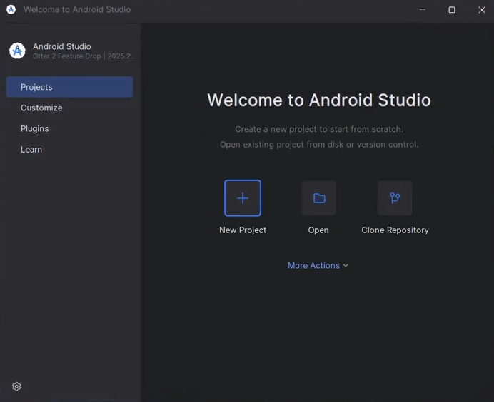
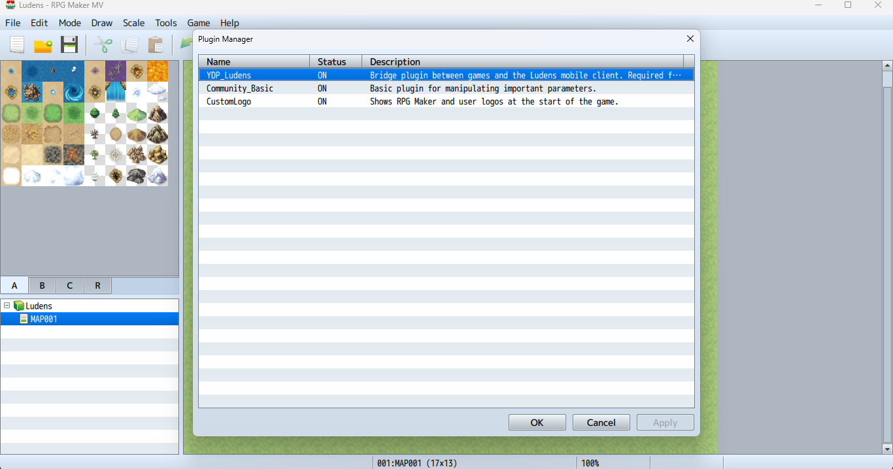
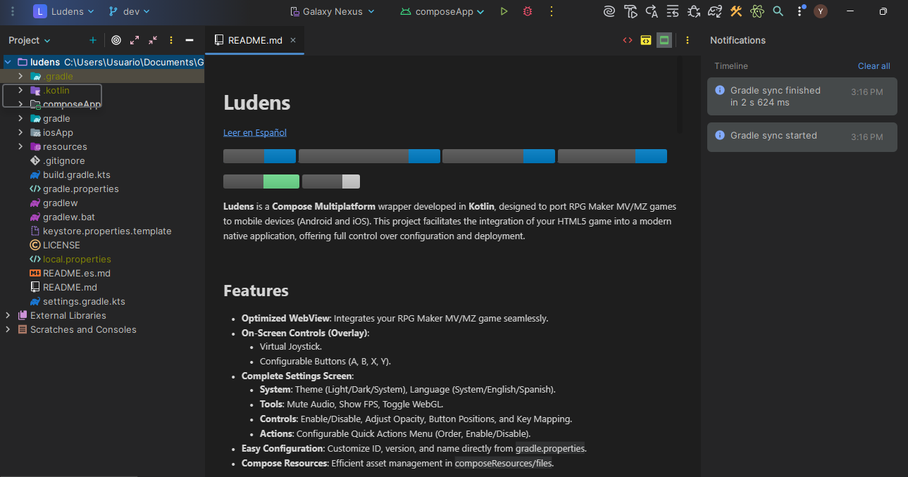

import { FileTree } from '@astrojs/starlight/components';

This guide walks you through the prerequisites and initial setup required to build your **RPG Maker MV and MZ** games as native applications using Ludens.

### How Ludens Works

Before starting, it's helpful to understand the architecture: Ludens does not natively recompile your game's JavaScript code into Java/Kotlin. Instead, it takes your web-exported RPG Maker game and wraps it in a **Compose Multiplatform** container. It runs the game using a native mobile **WebView** while rendering a transparent native UI overlay on top of it. This overlay contains the virtual joystick and action buttons, which communicate with the underlying game engine by injecting JavaScript events.

:::caution[iOS Support]
The build for **iOS** is not fully configured yet and uses the default Compose Multiplatform template configuration. This guide focuses on Android.
:::

## Prerequisites

### Android Studio

Download and install Android Studio. Version **Otter 2 Feature Drop | 2025.2.2** or higher is recommended.

- [Download Android Studio](https://developer.android.com/studio)
- [Installation Guide](https://developer.android.com/studio/install)
- [Official Setup Guide](https://developer.android.com/courses/pathways/android-basics-compose-unit-1-pathway-2)



Ensure the following components are included during installation:

- **Android SDK**
- **Android SDK Platform-Tools**
- **Android Virtual Device** (recommended for testing)

### Java Development Kit (JDK)

The project requires **Java 17** or higher. Android Studio usually includes a compatible version (JetBrains Runtime), but you can install JDK 17 manually if needed. If you are building outside of Android Studio, make sure the `JAVA_HOME` environment variable is set.

- [Official JDK Installation Guide](https://docs.oracle.com/java/javase/17/install/overview-jdk-installation.html)

### Gradle Build Tool

Ludens includes a Gradle Wrapper, meaning you do **not** need to install Gradle manually. The project uses the included script (`gradlew` for macOS/Linux, `gradlew.bat` for Windows) to ensure the correct Gradle version is used automatically.

### RPG Maker MV/MZ Game

You need your RPG Maker project exported for web deployment. See the [Game Export](/guide/game-export/) section for details.

### Recommended Plugin

Including the [`YDP_Ludens.js`](https://github.com/yoimerdr/rpgm-plugins) plugin in your RPG Maker project is optional but highly recommended:

- **Font Loading Fix**: RPG Maker MV relies on outdated document synchronous loading methods for fonts. Modern Android WebViews block this, resulting in missing text. The plugin patches the engine to use modern, asynchronous Web Font APIs.
- **Engine Bridge**: Enables smoother communication between the Ludens native client and the game engine.
- **Placement**: It **must be the first plugin** in your plugin manager list to ensure it patches core behaviors before any other plugin executes.
- Latest version and other recommended plugins are available at the [rpgm-plugins repository](https://github.com/yoimerdr/rpgm-plugins).



:::note[Plugin Compatibility]
Many RPG Maker plugins are designed for PC (desktop) only. Verify that all plugins used in your game are compatible with mobile environments (WebView) before building.
:::

## Get the Project

1. Clone the repository or download it as a ZIP and extract it:
   ```bash
   git clone https://github.com/yoimerdr/ludens.git
   ```
2. Open **Android Studio**.
3. Select **Open** and navigate to the `ludens` project folder.
4. Wait for Gradle to finish syncing. **Note:** The first time you open the project, Gradle will download the required dependencies. This process can take several minutes and download around 500MB of data.

### Game Orientation

By default, the Ludens application is configured to run in Landscape mode (`sensorLandscape`). If your game is designed for Portrait mode, you will need to change this configuration in the Android Manifest. See the [Android Configuration](/configuration/android/#game-orientation) guide for details.



## Directory Structure

Once the project is open, familiarize yourself with these key locations:

<FileTree>
- ludens/
  - composeApp/
    - src/
      - commonMain/
        - composeResources/
          - files/ Your game goes here
  - gradle.properties App configuration
  - keystore.properties.template Signing template
</FileTree>

## Next Steps

Once your environment is ready, proceed to:

1. [Export your game](/guide/game-export/) from RPG Maker.
2. [Configure and build](/guide/build/android/) your Android APK.
